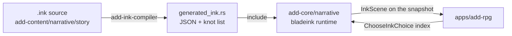

# ADD Narrative Runtime: the ink boundary

Status: contract for the live ADD game, as of N1.

> Scope note: this covers the ADD game lane. It describes the ink layer added
> by N1 of the [narrative plan](add-narrative-system-plan.md); the design it
> implements is the [Narrative System Specification](narrative-system-specification.md).

Ink declares, Rust computes. A knot owns a beat's prose, its choice
presentation and its scene flow. It owns no world state: taking a choice
applies the effects the authored catalog already holds for that choice id.

## Where does this change belong?

| Change | Owner | First verification |
| --- | --- | --- |
| A beat's prose, choice wording, or scene flow | `packages/add-content/narrative/story/*.ink` | `npm run content:check` |
| What a choice *does* (effects, flags, qualities) | `packages/add-content/src/content/story/` | `npm run content:check` |
| Scene collection, tags, choice binding | `crates/add-core/src/narrative/` | `cargo test -p add-core` |
| Compiling `.ink` into the engine | `crates/add-ink-compiler/` | `npm run content:check` |
| Rendering a scene to the player | `apps/add-rpg/src/browser/main.ts` | `npm run smoke:add-rpg:built` |

## Adoption is beat by beat

A beat is ink-backed when `main.ink` declares a knot named after it:
`story.beat.first_glimpse` → `=== story_beat_first_glimpse ===`. Beats without
a knot keep rendering from the catalog's `body`, unchanged. `beat_has_knot`
answers from `MAIN_INK_KNOTS`, a list the compiler generates from the source.

Today exactly one beat is ink-backed: `story.beat.first_glimpse`.

## The pipeline



`bladeink-compiler` is host-only and never reaches the browser: compilation
happens in `crates/add-ink-compiler` at build time, and the WASM ships only the
runtime. `npm run content:build` writes `crates/add-core/src/generated_ink.rs`;
`npm run content:check` fails on drift, exactly like the content catalogs.

## How a choice binds to its effects

bladeink 2.0.0 does not populate `Choice::tags` (measured in the
[N0 spike](add-narrative-bladeink-spike.md)), so a choice cannot carry its
authored id as a tag. Instead each branch assigns an ink variable:

```ink
* [Study the lights]
    ~ chosen = "story.choice.glimpse.watch_lights"
    The light pulses in time with the hum. # speaker:narrator
    -> DONE
```

The runtime reads `chosen` after `choose_choice_index` and hands that id to the
existing catalog path, so there is one source of truth for what a choice does.
A branch that sets no `chosen` is refused: it would present an option that
changes nothing.

Presented choice ids come from the authored catalog **by position**, and
`presented_choice_ids_agree_with_what_ink_records` proves that position for
every choice of every ink beat. Reorder or rename an ink choice and that test
fails rather than the wrong effects applying.

## Tags are the presentation channel

Tags on a line reach the browser verbatim on `InkLine.tags`:

| Tag | Meaning |
| --- | --- |
| `# speaker:vell` | who says the line |
| `# mood:tense` | music and lighting hint |
| `# sfx:door` | one-shot sound |
| `# camera:close` | framing hint |

The app renders `speaker` and `mood` as `data-` attributes on the line, so
presentation can hang off them without the browser parsing ink.

## Ink state is never saved

`bladeink`'s `save_state` is **not stable across a save/reload boundary** — its
thread counters diverge — so persisting it breaks
`command_log_replay_is_deterministic_across_save_reload`, the repository's
replay invariant.

The scene is therefore derived, never stored as truth. On demand the runtime
builds a fresh story, enters the beat, and replays the choice already recorded
in `choice_by_beat`. `the_scene_survives_save_and_reload` and the committed
scenario both assert that no ink state reaches the save.

This follows the specification's principle 2: nothing is stored that the
authoritative state cannot rebuild.

## Seeding

Ink has no Rust seed setter. The simulation's `rng_seed` crosses into ink as
the `ink_seed` variable at story construction, clamped into `i32` so ink's
arithmetic stays defined. Ink's own `RANDOM` and shuffles derive from
`SEED_RANDOM`, which authored content calls with that variable when it needs
them. There is still exactly one seed, owned by `GameState`.

## Focused verification

| Check | Command |
| --- | --- |
| Scene collection, choice binding, save/reload | `cargo test -p add-core` |
| Ink compiles and the generated file has not drifted | `npm run content:check` |
| The beat runs headlessly end to end | `npm run scenario:add -- scenarios/add/narrative/ink-first-glimpse.json` |
| The beat plays in the real app | `npm run smoke:add-rpg:built` |
| WASM stays inside budget | `npm run qa:add-rpg:size:built` |

## Known gaps

- One beat is ink-backed. The other eleven render from the catalog `body`.
- The ink response line is transient: taking a choice completes the beat and
  the selector advances, so the player-facing response still comes from the
  authored `StoryChoiceDef.response`. Making ink own the response needs the
  beat to stay active for a beat-end step, which is N5 work.
- `# locked:` choices from the specification's §4 are not implemented, so the
  lint that every locked choice has an unlocked twin has nothing to check yet.
- External functions are not bound. `standing`, `knows` and the rest of the
  §9 bridge arrive with N3 and N4.
- The runtime rebuilds the story per beat change and per choice rather than
  caching it, because `Simulation` derives `Clone` and `Debug` that
  `bladeink::Story` cannot. Cheap at one knot; revisit when the story grows.
