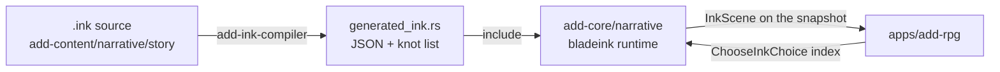

# ADD Narrative Runtime: the ink boundary

Status: contract for the live ADD game, as of N1.

> Scope note: this covers the ADD game lane. It describes the ink layer added
> by N1 of the [narrative plan](add-narrative-system-plan.md); the design it
> implements is the [Narrative System Specification](narrative-system-specification.md).

Ink declares, Rust computes. A knot owns a beat's prose, its choice
presentation and its scene flow. It owns no world state: taking a choice
applies the effects the authored catalog already holds for that choice id.

## Where does this change belong?

| Change | Owner | First verification |
| --- | --- | --- |
| A beat's prose, choice wording, or scene flow | `packages/add-content/narrative/story/*.ink` | `npm run content:check` |
| What a choice *does* (effects, flags, qualities) | `packages/add-content/src/content/story/` | `npm run content:check` |
| Scene collection, tags, choice binding | `crates/add-core/src/narrative/` | `cargo test -p add-core` |
| Compiling `.ink` into the engine | `crates/add-ink-compiler/` | `npm run content:check` |
| Rendering a scene to the player | `apps/add-rpg/src/browser/main.ts` | `npm run smoke:add-rpg:built` |

## Adoption is beat by beat

A beat is ink-backed when `main.ink` declares a knot named after it:
`story.beat.first_glimpse` → `=== story_beat_first_glimpse ===`. Beats without
a knot keep rendering from the catalog's `body`, unchanged. `beat_has_knot`
answers from `MAIN_INK_KNOTS`, a list the compiler generates from the source.

Today exactly one beat is ink-backed: `story.beat.first_glimpse`.

## The pipeline



`bladeink-compiler` is host-only and never reaches the browser: compilation
happens in `crates/add-ink-compiler` at build time, and the WASM ships only the
runtime. `npm run content:build` writes `crates/add-core/src/generated_ink.rs`;
`npm run content:check` fails on drift, exactly like the content catalogs.

## How a choice binds to its effects

bladeink 2.0.0 does not populate `Choice::tags` (measured in the
[N0 spike](add-narrative-bladeink-spike.md)), so a choice cannot carry its
authored id as a tag. Instead each branch assigns an ink variable:

```ink
* [Study the lights]
    ~ chosen = "story.choice.glimpse.watch_lights"
    The light pulses in time with the hum. # speaker:narrator
    -> DONE
```

The runtime reads `chosen` after `choose_choice_index` and hands that id to the
existing catalog path, so there is one source of truth for what a choice does.
A branch that sets no `chosen` is refused: it would present an option that
changes nothing.

Presented choice ids come from the authored catalog **by position**, and
`presented_choice_ids_agree_with_what_ink_records` proves that position for
every choice of every ink beat. Reorder or rename an ink choice and that test
fails rather than the wrong effects applying.

## Tags are the presentation channel

Tags on a line reach the browser verbatim on `InkLine.tags`:

| Tag | Meaning |
| --- | --- |
| `# speaker:vell` | who says the line |
| `# mood:tense` | music and lighting hint |
| `# sfx:door` | one-shot sound |
| `# camera:close` | framing hint |

The app renders `speaker` and `mood` as `data-` attributes on the line, so
presentation can hang off them without the browser parsing ink.

## Ink state is never saved

`bladeink`'s `save_state` is **not stable across a save/reload boundary** — its
thread counters diverge — so persisting it breaks
`command_log_replay_is_deterministic_across_save_reload`, the repository's
replay invariant.

The scene is therefore derived, never stored as truth. On demand the runtime
builds a fresh story, enters the beat, and replays the choice already recorded
in `choice_by_beat`. `the_scene_survives_save_and_reload` and the committed
scenario both assert that no ink state reaches the save.

This follows the specification's principle 2: nothing is stored that the
authoritative state cannot rebuild.

## Seeding

Ink has no Rust seed setter. The simulation's `rng_seed` crosses into ink as
the `ink_seed` variable at story construction, clamped into `i32` so ink's
arithmetic stays defined. Ink's own `RANDOM` and shuffles derive from
`SEED_RANDOM`, which authored content calls with that variable when it needs
them. There is still exactly one seed, owned by `GameState`.

## Tools (N2)

Tools before content: the story can be grown without growing the number of ways
it can silently break.

| Command | What it does |
| --- | --- |
| `npm run narr:fuzz` | 1,000 policy-driven playthroughs with a coverage report |
| `npm run narr:fuzz:gate` | 10,000 runs; belongs with the phase gate, not the focused loop |
| `npm run narr:schema` | One JSON export of the narrative vocabulary, as agent context |
| `npm run narr:lint` | Cross-references `.ink` against the story catalog (also inside `content:check`) |

**Policies.** Uniform random under-explores: it takes the first choice as often
as the last and never persists with either. Runs rotate through `uniform`,
`first`, `last` and `novelty` (prefer the least-taken choice), so
ordering-sensitive content is reached. The specification's axis-seeking
policies — maximise one axis, maximise secrecy — arrive with N3, since there
are no axes yet.

**What counts as a fault.** A presented choice the runtime refuses (read from
P1.3's `CommandOutcome`, not inferred), and a beat that stays active while its
choices change nothing. Both report the run's full command log, so a failure
ships as a replayable sequence rather than a description.

**Determinism.** A run is reproducible from its seed and policy alone, and
`a_recorded_run_replays_byte_identically` asserts two replays of a log produce
identical saves. The fuzzer's generator is deliberately separate from the
simulation's: it picks which choice to take, never what the game does.

**Lint.** `narrative-lint.cjs` fails when a knot names no story beat, when a
choice records no `chosen`, when it records an id that is not a choice of that
beat, or when ink never offers an authored choice — which would leave effects
in the catalog the player can never trigger. The runtime invariants that need
the runtime to prove stay as Rust tests.

## Standing (N3a)

The eleven axes, the impact pipeline and the event log. What the engine owns
versus what content owns:

| Concern | Owner |
| --- | --- |
| Axes, tiers, bands, derived constructs, saturation, inheritance rules | `crates/add-core/src/narrative/{standing,graph,log}.rs` |
| Which entities exist and who they belong to | `packages/add-content/src/content/narrative-entities.ts` |
| What each act does, and at which tier and scope | `packages/add-content/src/content/narrative-acts.ts` |
| Which canon subject an entity stands for | `content/lore-refs.ts` |

**Nothing is stored.** Standing is folded from the log on read. That is the
specification's principle 2, and it is what lets a tuning change take effect on
an existing save: the same history simply folds to different numbers. The save
carries events, and the committed scenario asserts it carries no scores.

**One act, three distances.** An impact's `scope` resolves against the act's
target — `Target`, `ParentOf(Target)`, `FactionOf(Target)` — and
`inheritance_weight` attenuates once per level by the group's kind. So helping
one survivor reaches them fully, their crew at 0.4, and the faction beyond
that more weakly still. Impacts never travel sideways or downward.

**Writers pick tiers, never numbers.** An act declares a tier and a sign; the
pipeline applies negativity per axis (integrity 2.5, goodwill 2.0), intent,
cost, need and repetition (0.7^n), clamps the product to 0.1–4, then folds with
saturation.

**`npm run narr:explain -- <entity> <axis> --save <path>`** prints every
contribution with each factor's input and the running score. The trace comes
from the same fold that produces the number, so an explanation cannot disagree
with what it explains.

## Values, decay and observer modifiers (N3b)

**The value circle (§5B).** Schwartz's ten values on a circle, held as relative
priorities that sum to zero — what drives behaviour is what someone ranks
*above* what. An act declares the values it *expresses*; an impact with
`sign: 0` takes its sign and strength from how each observer reads them,
scaled by the group's tightness.

This is what lets one act read as virtue to one group and betrayal to another
with nothing scripted to disagree. Sharing scarce water expresses
universalism; the Sleepless in Decibels put security and their own first, so
the faction reads the same generosity as resources given away:

```
entity.sleepless | alignment | score -4.67 | band mid
  act.share_scarce_water  tier=moderate verdict=-0.29 decay=1.00 -> -4.67
```

The person helped is still grateful. Values change how a group *reads* an act,
not whether help was help.

**Profiles are inherited unless authored.** Only a character who differs needs
one, and a low-fit member is where the Hero finds a dissenter — `values_fit`
is the correlation between an individual's priorities and their group's.

**Decay.** Each contribution fades by its tier's half-life in game days
(Trivial 3, Minor 10, Moderate 30, Major 120), computed at read time from the
event's tick. `Severe` and `Defining` never fade, and neither do the ledger
axes: debt and grievance settle through acts, not through time. What decays is
the contribution, so an old kindness still counts a little years later.

**Observer amplifiers.** Closeness raises what lands on a close bond.
Belonging applies the black-sheep rule: being one of them buys the benefit of
the doubt on small slips and a harsher fall on big ones. Both are themselves
folded axes, so they are computed in a first pass with the amplifiers neutral —
one extra bounded pass, which keeps them from being self-referential.

## Focused verification

| Check | Command |
| --- | --- |
| Scene collection, choice binding, save/reload | `cargo test -p add-core` |
| Ink compiles and the generated file has not drifted | `npm run content:check` |
| The beat runs headlessly end to end | `npm run scenario:add -- scenarios/add/narrative/ink-first-glimpse.json` |
| The beat plays in the real app | `npm run smoke:add-rpg:built` |
| WASM stays inside budget | `npm run qa:add-rpg:size:built` |

## Known gaps

**N3 is done; parts of §5 and §5B remain.** The graph, the log, the axes, the
pipeline, the value circle, decay and the observer amplifiers are in. Still
open, and deliberately not stubbed:

- **Ledger settlement.** `debt` and `grievance` accumulate but do not settle,
  sour after 60 days, or ruminate in honour-bound groups. `settles_by` is not
  modelled.
- **Association.** Judging the Hero by the company he keeps needs NPC-to-NPC
  edges, which do not exist yet.
- **Stance** (admiration, envy, pity, contempt) and the BIAS-map behavioural
  scripts that hang off it.
- **Hypocrisy.** Detecting two faces needs the Hero's revealed profile per
  observer, which needs knowledge — so it follows N4 rather than N3.
- **Generated deviants.** Profiles are hand-authored; `narr generate`,
  deviation rates and concealment are not built.
- **Honour and audience.** No tier escalation for public slights.
- Standing is not yet on the agent report's diagnostics channel, so scenario
  checkpoints assert on the log rather than on scores; the Rust acceptance test
  asserts the scores directly.
- Nothing gates on standing in authored content yet, so "changes available
  options" is proven at the engine level rather than through a story gate.

- **Fuzz coverage reaches 5 of 12 beats.** 10,000 runs finish clean, but every
  run ends at the step budget rather than exhausting the story, because the
  later arc is gated on gameplay — travel, construction, crew — that the
  fuzzer does not drive. It explores story choices, world actions and time.
  `beatsNeverSeen` names the seven it cannot reach, and
  `story.choice.exposed.steady` is the one authored choice nothing takes. The
  concrete next step is seeding runs from a committed scenario prefix such as
  `idle-base-first-cycle`, which needs the replay vocabulary widened past the
  four commands it knows today.
- One beat is ink-backed. The other eleven render from the catalog `body`.
- The ink response line is transient: taking a choice completes the beat and
  the selector advances, so the player-facing response still comes from the
  authored `StoryChoiceDef.response`. Making ink own the response needs the
  beat to stay active for a beat-end step, which is N5 work.
- `# locked:` choices from the specification's §4 are not implemented, so the
  lint that every locked choice has an unlocked twin has nothing to check yet.
- External functions are not bound. `standing`, `knows` and the rest of the
  §9 bridge arrive with N3 and N4.
- The runtime rebuilds the story per beat change and per choice rather than
  caching it, because `Simulation` derives `Clone` and `Debug` that
  `bladeink::Story` cannot. Cheap at one knot; revisit when the story grows.
