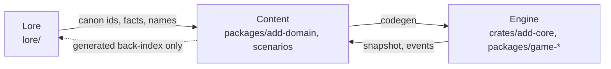

# Lore, Engine, and Content: The Three Bricks

Status: canonical boundary contract for the ADD lane.

> Scope note: this contract covers the ADD game lane. The office/platform lane
> (`apps/web/`, `apps/api/`, `apps/world-server/`, `apps/media-gateway/`) has
> its own boundaries and is not governed by this document.

The ADD game is built from three bricks. They are connected and
interdependent, but each has one owner, one authoring format, one verification
command, and one direction of dependency. Getting a change into the wrong
brick is the most expensive mistake available in this repository, because it
creates a second source of truth that nothing checks.

This document names the bricks, fixes the dependency direction, and says how
the boundary is enforced. It exists because the [Narrative System
Specification](narrative-system-specification.md) introduces authored world
data (entities, acts, values, sifting patterns, storylets) that sits exactly on
the lore/content seam and would drift immediately without a written rule.

## The three bricks

| Brick | Question it answers | Lives in | Authoring format | First verification |
| --- | --- | --- | --- | --- |
| **Lore** | What is true in this world? | `lore/` | Markdown wiki + `lore/data/*.json` | `npm run lore:check` |
| **Engine** | What can happen, and what happens next? | `crates/add-core/`, `crates/add-web-bindings/`, `crates/add-scenario*/`, `packages/game-*` | Rust and neutral TypeScript | `cargo test -p add-core` |
| **Content** | What exists in this particular game, and what does it say? | `packages/add-domain/`, `scenarios/` | TypeScript content modules, JSON fixtures, `.ink` scripts | `npm run content:check` |

### Lore owns canon, not behavior

`lore/` is the world bible: history, factions, characters, places, creatures,
terminology, tone. It is written for humans and agents who need to know what is
true before they author anything.

Lore owns:

- Facts, names, chronology, causality, and the canon status of each
  (`Canon`, `Internal`, `Draft`, `Open Question`).
- Shared structured canon in `lore/data/*.json`, transcluded into pages by the
  `<!-- lore:include -->` mechanism and rendered by `npm run lore:render`.
- Tone, vocabulary, and the reference bible.

Lore owns nothing that runs. It contains no balance numbers, no IDs the engine
resolves, no conditions, and no effects. A lore page may describe that the
Keepers execute deserters; it never states the `grievance` tier that produces.

### Engine owns rules, not material

The engine is the authoritative simulation and the neutral primitives beneath
it. It owns state transitions, determinism, time, saves, and the *vocabulary*
in which content can express itself.

Engine owns:

- `GameState` and every mutation of it (`crates/add-core/src/simulation.rs`).
- The type of thing content is allowed to say: `Condition`, `EffectDef`,
  `GameCommand`, `GameEvent`, axis and tier definitions.
- Determinism: one seeded generator, one clock, one save format, one migration
  registry (`CURRENT_SCHEMA_VERSION`).
- Neutral topology, world, visibility, and renderer contracts (`packages/game-*`).

The engine contains no authored material. Every catalog file under
`crates/add-core/src/game_data/catalog/` is generated and carries a
`@generated` banner. Adding a new *kind* of rule is an engine change; adding
another instance of an existing rule is a content change.

### Content owns the material, and binds the other two

Content is the game as authored: which beats, resources, stations, entities,
acts and storylets exist, what they cost, and what they say. It is the only
brick that is allowed to know about both of the others.

Content owns:

- Authored catalogs in `packages/add-domain/src/content/`.
- Player-facing copy and, once the narrative system lands, `.ink` prose.
- Derived presentation and explanations in `packages/add-domain/src/adapters/`.
- Committed scenarios and fixtures in `scenarios/`.
- The lore links in `content/lore-refs.ts` that tie a content ID to the canon
  it implements.

## Dependency direction

The direction is strictly one-way. Nothing in this repository should ever
create an edge pointing backwards along it.



Read it as four rules:

1. **Content may cite lore.** `packages/add-domain/src/content/lore-refs.ts`
   maps a content ID to the canon subject it implements. This is a string,
   resolved by tooling, not an import.
2. **Content compiles into the engine.** Authored TypeScript is code-generated
   into Rust catalogs by `scripts/build-add-content.cjs`. The engine never
   imports content; content is *placed into* it by the generator.
3. **The engine may not know lore or content exists.** `crates/add-core` must
   compile and pass its tests with no knowledge of why a value is what it is.
   If a rule needs to name a specific entity to work, the rule is in the wrong
   brick.
4. **Lore never authors a link to content.** The navigation from a lore page to
   its implementation is *generated* from the content brick's link registry
   into a `<!-- lore:generated -->` block, exactly like `lore/data/canon.json`
   is transcluded today. This keeps the authored dependency one-way while
   giving humans both directions of navigation. The registry and its checker
   exist; the generated back-index block does not yet.

The back-edge in the diagram is dotted because it is generated output, never
authored input.

## Where does this change belong?

| Change | Brick | Path | First verification |
| --- | --- | --- | --- |
| A world fact, a character's history, a place, a name, a canon status | Lore | `lore/` | `npm run lore:check` |
| Shared structured canon consumed by several lore pages | Lore | `lore/data/*.json` | `npm run lore:check` |
| A new kind of condition, effect, command, event, axis, or state field | Engine | `crates/add-core/src/` | `cargo test -p add-core` |
| Determinism, saves, migrations, time advancement, offline catch-up | Engine | `crates/add-core/src/` | `cargo test -p add-core` |
| Neutral topology, world, visibility, renderer, or input contracts | Engine | `packages/game-*` | `npm run agent:verify:types` |
| A new beat, resource, station, role, item, creature, perk, act, or entity | Content | `packages/add-domain/src/content/` | `npm run content:check` |
| Balance numbers, costs, durations, tiers | Content | `packages/add-domain/src/content/` | `npm run content:check` |
| Player-facing copy, dialogue, `.ink` prose | Content | `packages/add-domain/` | `npm run content:check` |
| Snapshot explanation, available-action projection, blocker copy | Content | `packages/add-domain/src/adapters/` | `npm run agent:verify:add-ui` |
| A committed scenario, fixture, or replay | Content | `scenarios/` | `npm run scenario:add -- scenarios/add/<id>.json` |
| The lore link tying a content ID to its canon subject | Content | `packages/add-domain/src/content/lore-refs.ts` | `npm run lore:refs:check` |

When a change seems to belong in two bricks, it is usually one engine change
plus one content change, and they should be separable. If they are not, the
engine change is probably too specific.

## What is already true today

Most of this boundary already exists; it has simply never been named or
enforced. Recording the current state honestly matters more than proposing a
reorganization.

| Property | State today | Evidence |
| --- | --- | --- |
| Lore is separate from the game | Yes | `lore/` is 389 tracked files with its own Python tooling and its own site build; nothing in `apps/` or `crates/` reads it |
| Engine is free of authored material | Yes | Every `crates/add-core/src/game_data/catalog/*.rs` is `@generated`; hand-written rules live in `simulation.rs` and `game_data.rs` |
| Content compiles into the engine | Yes | `scripts/build-add-content.cjs` with a `--check` drift mode and a golden catalog snapshot |
| Content does not reimplement engine rules | Yes | `packages/add-domain/test/architecture.test.js` enforces the renderer boundary; command availability now consumes Rust outcomes and catalog-owned `BlockerDef` labels |
| Lore links to content | Yes, one-way | `content/lore-refs.ts` cites lore by path; `npm run lore:refs:check` resolves every link and reports both coverage gaps |
| Boundary is machine-checked | **Partial** | Renderer direction and content drift are checked; brick direction is not |

So the work is not a migration. It is: add the missing lore-to-content link,
and add the checks that keep the existing direction from eroding.

## Enforcement

Three checks hold the boundary. Two exist; one is new.

**1. Content-to-engine drift (exists).** `npm run content:check` regenerates
the Rust catalogs and fails if the checked-in output drifted from the authored
TypeScript. `cargo test -p add-core` additionally holds a golden snapshot of
the whole catalog, so a data change is always visible in review.

**2. Import direction (exists).**
`packages/add-domain/test/architecture.test.js` asserts that the domain package
does not depend on the renderer, and additionally that:

- no file under `crates/add-*/src` or `packages/game-*/src` cites `lore/`;
- no file under `packages/add-domain/src/` cites `lore/` except
  `content/lore-refs.ts`.

Both are negative-tested: planting a lore path in an engine source file fails
the suite with the offending path named.

**3. Lore reference integrity (exists).** `npm run lore:refs:check`:

- resolves every reference to a lore page and, when one is given, to a heading
  anchor on that page, and **fails** on a dangling path, an unknown anchor, a
  reference to an unknown content ID, a reference outside `lore/`, or a
  duplicate;
- **reports** content IDs in a lore-linked family with no reference, so the
  unbound surface is visible;
- **reports** lore subjects no content implements — the list of things the
  world knows about that the game cannot yet show. This backlog is large on
  purpose: 344 subjects today.

Correctness is fatal; coverage is informational. Demanding canon for every ID
would manufacture busywork, so `LORE_LINKED_FAMILIES` narrows coverage
reporting to the families the world has an opinion about: area, creature,
dungeon, item, resource, station, story beat, structure, tile.

### How a link is written

Links live in one sidecar registry,
`packages/add-domain/src/content/lore-refs.ts`, keyed by content ID:

```ts
export const LORE_REFS: readonly LoreRef[] = [
  {
    contentId: "structure.base",
    loreRef: "lore/locations/touraine/studio_echo.md",
    note: "Studio Echo is the Hero's Base settlement.",
  },
  {
    contentId: "structure.crystal_circle",
    loreRef: "lore/locations/touraine/studio_echo.md#the-crystal",
  },
]
```

Two decisions are recorded here, both deliberate.

**A sidecar, not a field on each definition.** The engine must run without
knowing lore exists, so a lore link must never reach generated Rust. Keeping
links out of the content definitions makes that structural rather than a rule
the generator has to remember, gives one place to audit the whole edge, and
needs no change to the content types or the code generator. When the narrative
system adds entities — where a lore subject *is* the thing being defined — an
inline `loreRef` becomes natural, and the checker can then read both.

**A path, not a front-matter id.** Lore pages carry no front matter, and adding
it to 388 files to invent a second identifier would be churn for no gain: the
path is already unique and stable, and `npm run lore:check` already validates
1,275 markdown links, so lore renames are an existing, maintained discipline. A
reference is therefore `lore/<path>.md` with an optional `#heading-anchor`,
slugged GitHub-style. Front matter stays available if pages ever need to move
freely.

## How the narrative system uses the bricks

The [Narrative System Specification](narrative-system-specification.md) is the
first system that genuinely spans all three. Its pieces distribute like this,
and the [ADD Narrative System Implementation Plan](add-narrative-system-plan.md)
follows this split for every milestone.

| Specification concept | Brick | Where it lands |
| --- | --- | --- |
| Who the Keepers are, their history, what Ashfield is | Lore | `lore/factions/`, `lore/characters/` |
| The eleven axes and how they combine into `trust` | Engine | `crates/add-core/` |
| The impact pipeline, decay, saturation, inheritance math | Engine | `crates/add-core/` |
| The event log, knowledge sets, rumor spread mechanics | Engine | `crates/add-core/` |
| The sifter and the storylet caster | Engine | `crates/add-core/` |
| Which entities exist, their values, ranks, edges | Content | `packages/add-domain/src/content/narrative/` |
| Act definitions: tiers, scopes, expressed values | Content | `packages/add-domain/src/content/narrative/` |
| Relationship states, sifting patterns, storylet sidecars | Content | `packages/add-domain/src/content/narrative/` |
| Tuning tables: tier bases, modifiers, band edges, value angles | Content | `packages/add-domain/src/content/narrative/` |
| `.ink` prose, choices, scene flow | Content | `packages/add-domain/narrative/story/` |
| Reaction rules | Content | `packages/add-domain/src/content/narrative/` |

The specification's §12 puts all of this in RON files under `story/` and
`world/`. This repository already has a validated TypeScript-to-Rust content
pipeline with one ID namespace, one validator, one explainer and one reverse
lookup. The plan therefore keeps the specification's *data model* exactly and
changes only its *file format*, so the narrative system inherits
`content:check`, `content:explain`, `content:graph --reverse` and the golden
catalog rather than growing a second toolchain beside them. That trade is
argued in the plan's "One content pipeline, not two" section.

## Focused verification

| Brick | Command | What it proves |
| --- | --- | --- |
| Lore | `npm run lore:check` | Links resolve and shared canon data is consistent |
| Lore | `npm run lore:render` | Transcluded canon blocks match `lore/data/*.json` |
| Engine | `cargo test -p add-core` | Rules, determinism, saves, and the catalog golden hold |
| Engine | `npm run agent:verify:types` | Neutral package contracts compile |
| Content | `npm run content:check` | Authored content validates and generated Rust has not drifted |
| Content | `npm run content:explain -- <id>` | A content ID exposes its definition, source, references and users |
| Content | `npm run scenario:add -- scenarios/add/<id>.json` | Authored content behaves deterministically against the engine |
| Boundary | `npm --workspace @aedventure/add-domain test` | Import direction assertions hold |
| Boundary | `npm run lore:refs:check` | Every lore link resolves; unbound content and unimplemented lore are reported |

## Known gaps

- Coverage is thin on purpose to start: 5 content IDs are linked and 38 remain
  unlinked in lore-linked families. The links that exist are ones that are
  actually true; the rest are reported rather than invented.
- The generated `<!-- lore:generated -->` back-index does not exist yet, so
  navigation runs content-to-lore only. `lore:refs:check` already computes the
  reverse mapping it would need.
- 344 lore subjects have no implementing content. That number is the backlog,
  not a defect, but nothing yet distinguishes "not built yet" from "never
  intended to be game content".
- Availability and blocker evaluation is still projected in TypeScript rather
  than answered by the engine, so one rule currently has two implementations.
  This is tracked in the narrative plan, because the narrative system would
  otherwise inherit and enlarge it.
- The lore-path assertions are textual. They catch a path mention in engine or
  content source; they would not catch lore loaded through a computed path.
