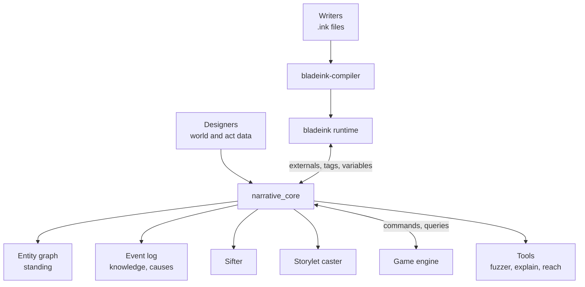
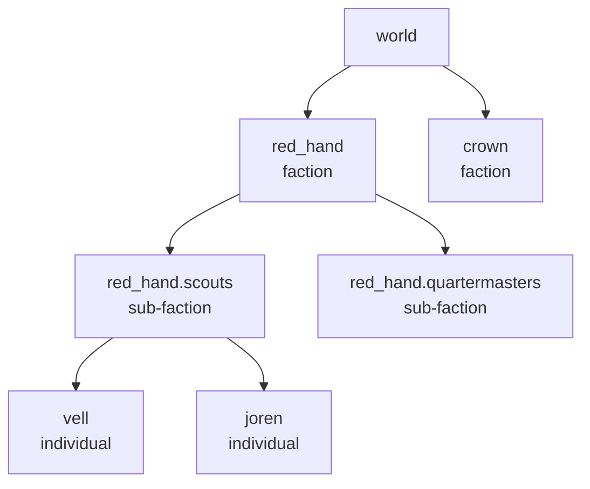

# Narrative System Specification

2026-09-20 · Christophe Henner

## 1. Purpose and scope

This system makes a simple-looking game carry deep, long-term consequences. Player decisions write to a persistent world model; every later conversation reads from it.

It combines five parts:

- An authored narrative layer in ink, run by the `bladeink` crate inside the homemade Rust engine.
- A standing model: multi-axis scores on a hierarchy of individuals, sub-factions and factions, with a blast radius per decision.
- An event log with witnesses, knowledge spread and causal links.
- Story sifting: pattern queries over the log that detect emergent arcs.
- Parameterized storylets: scenes written for roles, cast at runtime from the world model.

**Goals**

- A choice can change the hero's available options hours later, for reasons the player can reconstruct.
- Consequences apply at the right radius: one person, a sub-faction, a faction, or the world.
- Writers declare what happened; they never write scoring math.
- Every gate in the story is explainable and testable by tools.
- All dependencies are open source. No LLM at runtime.

**Non-goals**

- Free-running NPC simulation (agents with their own goals and schedules). NPCs do act, but only through authored reaction rules in the story files, triggered by events.
- Procedural text generation. All prose is authored.
- Rendering, UI layout, audio. The system emits instructions; the engine presents them.

## 2. Design principles

Seven rules govern every later section. When two sections seem to conflict, these decide.

1. **Ink declares, Rust computes.** Ink scripts state what happened (`act`) and ask questions (`standing`, `knows`). All arithmetic, propagation and selection lives in Rust.
2. **The event log is the source of truth.** Standing scores are derived by replaying events. Nothing mutates a score without an event behind it.
3. **Accumulate, do not fork.** Choices write state; later scenes read it. Hard story forks are rare and deliberate.
4. **Scores gate, facts speak.** Numeric standing decides which options exist. Specific remembered events decide what characters say.
5. **Radius is a property of the act.** Each act definition states where its effects land. Writers pick an act; they do not pick numbers.
6. **Deterministic by construction.** Same seed plus same inputs gives the same playthrough. This is what makes fuzzing, replays and bug reports possible.
7. **Explainable on demand.** For any refused option, a tool can print the events and weights that produced the refusal.

## 3. Architecture overview

The system is one Rust crate, `narrative_core`, sitting between the ink runtime and the engine. The engine never talks to ink directly.



Ink calls into `narrative_core` through external functions; `narrative_core` answers from the graph and the log, and forwards presentation tags to the engine.

| Module | Responsibility | Depends on |
| --- | --- | --- |
| `story` | Owns the `bladeink::Story`, binds externals, parses tags, steps dialogue | bladeink |
| `graph` | Entities, hierarchy, faction relations, standing computation | `log` |
| `log` | Append-only events, knowledge sets, causal links, rumor spread | none |
| `acts` | Act definitions: what each named act does, and at which radius | `graph`, `log` |
| `sift` | Pattern matching over the log, arc detection | `log`, `graph` |
| `cast` | Storylet registry, role queries, salience selection | `graph`, `log`, `sift` |
| `save` | Serialization, versioning, migration | all |
| `tools` | Headless runner, fuzzer, reachability, explain | all |
| react | Reaction rules: authored event chains, NPC acts, chain depth and cooldown limits | log, graph, sift, acts |
| values | Value profiles, the circle, act verdicts, fit, the hero's revealed profile, hypocrisy detection, profile generation | graph, log |

**Threading.** `bladeink::Story` uses `Rc<RefCell>` internally, so it is not `Send`. `narrative_core` runs on one thread and exchanges messages with the engine through channels. Verify this against the pinned bladeink version before finalizing.

## 4. Narrative layer (ink)

Ink holds all prose, choices and scene flow, plus hero-local state. It holds no world scores.

**What lives where**

| State | Home | Example |
| --- | --- | --- |
| Hero traits and inner state | ink `VAR` and `LIST` | `traits ? merciful`, `oaths_broken` |
| Visit and choice history | ink read counts | `bandit_camp.spared` |
| Standing of any entity | Rust graph | `standing("vell", "trust")` |
| What happened, who knows | Rust log | `knows("vell", "killed_joren")` |
| Inventory, position, time | Engine, mirrored by externals | `has_item("seal")` |

**File conventions**

- One `.ink` file per location or major character, included from `main.ink`.
- Knot names are `snake_case` and globally unique. Storylet knots are prefixed `sl_`.
- Every choice that matters carries a label, for example `* (spared) [Spare him]`, so tools can address it.
- Entity and act ids in ink are string literals that must exist in the world data. The compiler step validates them (section 11).

**Tags as the command channel**

Tags carry presentation and metadata. The `story` module parses `key:value` pairs and forwards them to the engine.

| Tag | Meaning |
| --- | --- |
| `# speaker:vell` | Who says the line |
| `# mood:tense` | Music and lighting hint |
| `# sfx:door` | One-shot sound |
| `# camera:close` | Framing hint |
| `# locked:no_seal` | On a choice: show it disabled, with this in-fiction reason key. Only for visible world facts, never for standing |
| `# hub:camp_evening` | Storylet opportunity (section 8) |

**Hidden gates and locked choices.** Scores are hidden, so a choice gated on standing or a relationship state simply does not appear when the gate fails. No greyed-out option, no hint. The player learns that an option was lost through fiction: a character says why they will not hear it.

Greyed-out options are reserved for gates the player can already see in the world, such as a missing item. Ink hides choices whose condition is false, so a visible locked option is written twice:

```ink
// Hidden gate: appears only if the relationship allows it.
* {rel("vell", "ally")} [Ask for safe passage]
    -> vell_grants_passage

// Visible gate: shown disabled when the item is missing.
* {has_item("seal")} [Show the royal seal]
    -> vell_sees_seal
+ {not has_item("seal")} [Show the royal seal] # locked:no_seal
    -> DONE
```

The engine renders any choice tagged `locked` as disabled and never sends its index back. Lint rules: every `locked` choice has an unlocked twin, and no `locked` choice has a standing, band or relationship-state condition.

**Flows.** The main story runs in the default flow. Ambient commentary and the hero's inner voice run in named flows over the same state, so they react to the same variables without interrupting the main thread.

## 5. Standing model

Standing is how an entity regards the hero, on several axes, computed at read time from impacts recorded at the scope where they apply.

**Entity graph**

Every entity is a node with one optional parent. Four levels are enough to start.



An impact written on `red_hand.scouts` reaches Vell and Joren, and nobody in the quartermasters.

**Axes**

Eleven raw axes in three layers, derived from the person-perception, trust, relational and intergroup literatures. Each is in the range -100 to +100, default 0. The earlier draft's `trust`, `respect` and `fear` are no longer raw: research treats them as outcomes of more basic judgments, so they are now derived (next table). The set is data-driven and can change without code edits.

The selection rule was: an axis earns its place only if the literature treats it as a separate dimension, and if it can disagree with every other axis in a way that produces a recognizable human situation.

| Layer | Axis | What the entity believes or feels | Research basis |
| --- | --- | --- | --- |
| Character | `affection` | I like him; I enjoy his company | Communion, warmth facet (Abele and Wojciszke; Fiske, Cuddy and Glick, Stereotype Content Model); liking versus loving (Rubin) |
| Character | `goodwill` | He cares about my interests specifically | Benevolence in the trust model of Mayer, Davis and Schoorman (1995) |
| Character | `integrity` | He is honest, fair, keeps his word, whoever's side he is on | Morality facet of communion (Leach, Ellemers and Barreto 2007); moral character dominates impressions (Goodwin, Piazza and Rozin 2014) |
| Character | `competence` | He is able; he delivers | Agency, ability facet (Abele et al. 2016); source of prestige (Henrich and Gil-White 2001) |
| Character | `dominance` | He can and will impose his will by force | Agency, assertiveness facet; dominance route to rank (Cheng, Tracy et al. 2013); control axis of the interpersonal circumplex (Leary, Wiggins) |
| Bond | `closeness` | How well I know him, how much we have shared | Social penetration (Altman and Taylor); tie strength (Granovetter); mere exposure (Zajonc) |
| Bond | `dependence` | How much I need him to survive or prosper | Interdependence theory (Thibaut and Kelley); investment model (Rusbult); relational value (Leary) |
| Bond | `debt` | Positive: I owe him. Negative: he owes me | Norm of reciprocity (Gouldner 1960); equality matching in relational models theory (A. P. Fiske 1991) |
| Bond | `grievance` | Specific wrongs he did to me or mine, still unanswered | Transgression-related motivations: avoidance, revenge, benevolence (McCullough et al. 1998); vicarious retribution (Lickel et al. 2006) |
| Identity | `belonging` | He is one of us | Social identity and self-categorization (Tajfel and Turner); identity fusion (Swann) for families and belief groups |
| Identity | `alignment` | He shares and upholds what we value | Symbolic threat in intergroup threat theory (Stephan and Stephan); value congruence (Sagiv and Schwartz 2000); value system in section 5B |

Three design consequences follow from the research:

- `integrity` weighs most. Studies consistently find moral character outweighs both warmth and competence when people form impressions. In tuning, integrity impacts are larger and decay slowest, and a collapse in integrity drags derived trust down whatever else is high.
- `debt` and `grievance` are ledgers, not moods. They do not fade with a half-life; they change only when something settles them: repayment, apology, restitution, or revenge taken. Each entry points at its events, so a character can always say exactly what is owed or unforgiven.
- `closeness` has no valence. It is an amplifier: the closer the bond, the harder both kindness and betrayal land, and the more first-hand experience outweighs rumor.

**Derived constructs**

These are computed from the raw axes at read time and are what ink usually gates on.

| Derived | Computed from | Basis |
| --- | --- | --- |
| `trust` | `competence`, `goodwill` and `integrity`, limited by the weakest of the three | Mayer, Davis and Schoorman: ability, benevolence, integrity |
| `respect` | `competence` plus `integrity`: deference freely given | Prestige (Henrich and Gil-White) |
| `fear` | `dominance`, reduced by `goodwill` | Dominance route to rank (Cheng et al.) |
| `threat` | `dominance` with low `goodwill` and low `belonging` (danger to our resources), plus low `alignment` (danger to our way of life) | Realistic and symbolic threat (Stephan and Stephan); image theory (Alexander, Brewer and Herrmann) |
| `loyalty_to_hero` | `belonging`, `goodwill`, `debt`, `dependence`, minus `grievance` | Commitment in the investment model (Rusbult) |
| Stance: admiration, envy, pity, contempt | Warmth (`affection` and `goodwill`) crossed with `competence` | BIAS map (Cuddy, Fiske and Glick 2007) |

The stance row matters for behavior, because the BIAS map predicts what people do, not only what they feel. Admiration leads to helping and joining. Envy leads to cooperating while it pays, then attacking when the chance comes. Pity leads to protecting but also excluding. Contempt leads to neglect or open harm. Each stance gives storylets a default behavioral script for any NPC, which suits a hidden-score game where standing must show through behavior.

**Groups see the same act differently**

Group theory adds parameters on the group side, not more axes. Each faction and sub-faction carries:

| Parameter | Effect | Basis |
| --- | --- | --- |
| `kind`: family, belief group, crew, survival faction, loose association | Sets cohesion. Families and belief groups inherit more from the group and share blame and credit: wrong one member and every member holds the grievance | Entitativity (Campbell; Lickel et al. 2000); vicarious retribution (Lickel et al. 2006) |
| `values`: a profile over the ten basic values | Decides how the group reads every value-expressive act, its default relations with other groups, and how it treats its own deviants | Schwartz's theory of basic values (section 5B) |
| `tightness`, 0 to 1 | Multiplies the impact of norm violations. Derived from the profile by default. Groups under threat run tight, which fits survival groups | Tightness and looseness (Gelfand et al. 2011) |
| `honor`, 0 to 1 | Insults and slights create grievance that must be answered publicly; backing down costs `competence` and `dominance` in their eyes. Derived from the profile by default | Culture of honor in lawless, raidable economies (Nisbett and Cohen 1996) |

Sharing food with an outsider is a virtue to a universalist group and a betrayal to a security-minded one. This is how families, belief groups and survival factions come to disagree about the same hero without any of them being scripted to. The full value system is in section 5B.

Two further rules come from intergroup research:

- Black sheep effect (Marques): when `belonging` is high, violations are punished harder than the same act by an outsider. Being one of them buys the benefit of the doubt on small things and a harsher fall on big ones.
- Contact generalizes upward (Allport; Pettigrew and Tropp): an individual's first-hand view of the hero leaks into their group's view, scaled by that individual's `influence` and how typical of the group they are seen to be. Winning over an elder moves a family; winning over its outcast does not.

**Fit with the setting.** In a post-apocalyptic world of survival groups, `dependence`, `dominance` and the `threat` construct carry the survival pressure, while `belonging`, group `kind` and `values` carry the families and belief groups. Music is the game's theme and flavor. The social mechanics stay abstract: no axis, value or rule is specific to music. A musical action, such as playing together, enters the model the same way as any other action, through the action descriptor in section 5A.

References in this section are standard literature cited from general knowledge; check them before quoting outside the project.

**Effective standing**

An entity's effective standing on an axis is its own raw score plus attenuated ancestor scores plus spillover from faction relations, clamped.

```math
S(e,a) = \operatorname{clamp}\Big( \sum_{k=0}^{d} w_k \, r(\mathrm{anc}_k(e), a) \; + \sum_{f \in F} \rho(\mathrm{fac}(e), f)\, \lambda \, r(f, a),\; -100,\; 100 \Big)
```

- `r(n, a)` is the raw score of node `n` on axis `a`: the sum of all impacts recorded on that node, after decay.
- `anc_k(e)` is the k-th ancestor of `e`, with `anc_0(e) = e`.
- `w_k` are inheritance weights. They depend on the kind of group at each level; the table is in section 5A.
- `rho(f1, f2)` is the relation between two factions, from -1 (enemies) to +1 (allies). `lambda` is the spillover factor, default 0.25.

So harming the Red Hand lowers standing with their allies and raises it with their enemies, at a quarter strength.

**NPC-to-NPC relationships and association**

Characters hold feelings toward each other, and judge the hero by the company he keeps. If the hero is very supportive of NPC 1, and NPC 2 hates NPC 1, then NPC 2 cools toward the hero once NPC 2 learns of that support. This is the classic balance rule: the friend of my enemy is my enemy, the enemy of my enemy is my friend.

NPC-to-NPC edges are sparse and directed. Most pairs have no edge and count as indifferent. Each edge carries:

- `sentiment`, from -1 (hates) to +1 (loves): how A feels about B. Drives association.
- `closeness`, from 0 to 1: how much they are in contact. Drives rumor spread (section 6). Enemies can be close: rivals in the same band gossip constantly.

Each act definition states how it reads to onlookers: a `valence` toward its target (+1 supportive, -1 hostile) and an `association_weight`. When an observer O knows an event where the hero acted on target T, O receives a derived impact:

```math
\Delta(O, a) = \mu_a \cdot \mathrm{valence} \cdot \mathrm{weight} \cdot \mathrm{sentiment}(O \to T) \cdot \mathrm{fidelity}(O)
```

- `mu_a` is a per-axis transfer factor from the tuning file. Defaults: `affection` 0.4, `alignment` 0.5, `goodwill` 0.2, others 0. Association changes whether people like and side with the hero, not whether they fear, need or owe him.
- Supporting someone O hates: valence +1, sentiment negative, so the result is negative. Humiliating someone O hates: both negative, result positive.
- Group edges work the same way: an individual inherits its sub-faction's and faction's sentiment toward T's groups, attenuated by the inheritance weights. The faction relations in the formula above are this same rule at the top level.

Two safeguards keep it believable. Repeated support accumulates with diminishing returns (each further event toward the same target counts for less), so being very supportive matters more than one favor but cannot run away. And association never outweighs direct experience: it is capped at a fraction (default 50 percent) of the magnitude of O's own first-hand history with the hero.

Like every score, association is derived at read time from the log and O's knowledge, then cached. Nothing is stored that the log cannot rebuild.

**Edges can change.** NPC-to-NPC edges move in two ways, both logged. The hero can act on them directly, with impacts scoped `Between(A, B)`: he reconciles two rivals, or tells NPC 2 what NPC 1 said about her. And the story files can declare reactions: an event triggers an NPC's act, which is itself an event, which can trigger another (section 7, Reactions). Characters never act from free-running simulation; every NPC act traces back through authored rules to something that happened, which keeps the world deterministic and explainable.

This opens a layer of play that fits a hidden-score game well: the hero can pick sides, play people against each other, or broker peace, and the only way to map who hates whom is to pay attention.

**Per-entity modifiers**

- `loyalty` (0 to 1) scales how much an individual inherits from ancestors. It is derived from the individual's value fit with their group (section 5B): a dissident barely cares what the faction thinks.
- `axis_bias` adds a fixed offset per axis, for characters who start wary or devoted.

**Decay**

Each impact carries a half-life in game time, set by its act definition. Minor slights fade; betrayals are permanent. Decay is computed at read time from the event's tick and the current engine tick, so nothing runs in the background.

**Thresholds, not raw numbers, in ink**

Ink and data compare against named bands, not magic numbers. `standing_band("vell", "trust")` returns one of `very_low`, `low`, `mid`, `high`, `very_high`. Band names are neutral because axes differ in valence (high `grievance` is bad, high `trust` is good). Band edges live in the tuning table (section 12), so rebalancing never touches story files.

**Relationship states**

A relationship state is a named condition inferred from axes and known events, defined in data. Ink gates on states far more often than on single axes: `rel("vell", "indebted_rival")`.

```ron
RelState(
  id: "indebted_rival",
  all: [ Band(debt, AtLeast(high)), Band(respect, AtLeast(high)), Band(affection, AtMost(low)) ],
)
RelState(
  id: "wounded_loyalist",
  all: [ Band(belonging, AtLeast(high)), Band(grievance, AtLeast(high)), KnowsKind("betrayal") ],
)
RelState(
  id: "resentful_dependent",
  all: [ Band(dependence, AtLeast(high)), Band(affection, AtMost(low)), Stance(envy) ],
)
```

Conditions may use raw axes, derived constructs (`trust`, `respect`, `fear`, `threat`) and stances alike.

Starter states: `stranger`, `ally`, `confidant`, `protege`, `creditor`, `debtor`, `rival`, `indebted_rival`, `wounded_loyalist`, `cowed`, `nemesis`, `true_believer`, `opportunist`. Several can hold at once; `rel_primary(entity)` returns the most specific one that holds, for default tone selection.

Because content is LLM-implemented under human direction, the number of axes, states and ids is not a cost concern. The limit is analyzability, which `narr lint` and `narr reach` enforce (section 11).

**Scores stay hidden**

The player never sees an axis, a number, a band word or a state name. There is no journal summary and no confidant who reports how the hero is seen. Standing is legible scene by scene only, the way it is in real life. This makes principle 4 mandatory, not stylistic.

Real people rarely announce that they dislike you; they show it. So content should express standing through behavior as much as through statements:

- Tone, warmth and length of replies; whether a character starts the conversation or waits.
- Availability: who turns up, who is suddenly busy, who stops inviting the hero.
- Terms: prices, favors offered or withheld, how much a character is willing to risk.
- Second-hand signals: a third character repeats what is being said about the hero, which also teaches the player that rumor exists.
- Group behavior: a room going quiet, a sub-faction closing ranks.

Subtle cues (a musical or sound motif tied to how a character regards the hero, for example) are deferred. The tag channel already supports them, so adding cues later needs no change to the core.

## 5A. Impact scale

Nobody writes raw numbers on acts. An act declares a magnitude tier per axis, and one pipeline turns tiers into final impacts using context the engine and the graph already hold. Every number in the game traces back to the tier table and the modifier table below.

**The unit**

One point is 1 percent of an axis's half-range. The reference act is an ordinary favor between acquaintances, with no special cost, need or audience: it is worth 3 points of `goodwill`. Everything else is sized against it.

**Magnitude tiers**

Tiers are geometric, each about twice the last, because perceived intensity grows with ratios, not differences (Weber and Fechner; Stevens' power law). Six steps are about as many as people reliably tell apart.

| Tier | Base points | Reads as | Default half-life |
| --- | --- | --- | --- |
| `Trivial` | 1 | A nod, a rude word | 3 days |
| `Minor` | 3 | An ordinary favor or slight | 10 days |
| `Moderate` | 6 | Real help, a real insult, a promise kept | 30 days |
| `Major` | 12 | Took a risk for them, broke a promise, stole from them | 120 days |
| `Severe` | 25 | Saved a life, betrayed a confidence, killed one of theirs | Permanent |
| `Defining` | 50 | The thing they will always know him for | Permanent |

An act definition therefore reads `(scope: Target, axis: goodwill, tier: Major, sign: Minus)`. Tiers for ledger axes (`debt`, `grievance`) use the same table but never decay.

**The impact pipeline**

For each impact of an event, for each entity `e` that knows the event:

```math
\Delta = \mathrm{sign} \cdot B(\mathrm{tier}) \cdot \underbrace{N_a \cdot I \cdot C \cdot D}_{\text{the act}} \cdot \underbrace{K_e \cdot G_e \cdot M_e \cdot R_e}_{\text{the observer}} \cdot \underbrace{w_k \cdot F_e}_{\text{distance}}
```

`B` is the tier's base points. The act factors are negativity `N`, intent `I`, cost `C` and need `D`. The observer factors are closeness `K`, belonging `G`, values verdict `M` and repetition `R`. The distance factors are the inheritance weight `w` of the scope and the fidelity `F` of the observer's knowledge. Each factor is defined in the next table and defaults to 1.

The product of all factors is clamped to the range 0.1 to 4, so no stack of modifiers can turn a slight into a catastrophe or erase a betrayal.

**Any action can be an act**

The requirement is that anything the hero does can affect relationships, not only actions someone thought to define. So acts are not a closed list. Every act, authored or not, reduces to one abstract descriptor, and the pipeline works on the descriptor alone.

| Descriptor field | Question it answers | Drives |
| --- | --- | --- |
| `actor`, `target`, `others` | Who did it, to whom, involving whom | Scope of every impact |
| `effect` | Did it help or harm the target, and how much (tier) | `goodwill`, `grievance`, `debt`, `dependence` |
| `resource` | What was given, taken, destroyed or shared, and how scarce | Cost factor `C`, `debt`, `dependence` |
| `risk` | What the actor risked | Cost factor `C`, `competence`, `dominance` |
| `norm` | Did it break a universal norm: lie, theft, broken promise, failed reciprocity | `integrity`, fixed sign |
| `expresses` | Which values it expresses or violates | `alignment`, through the verdict `V` |
| `display` | Did it show skill or force | `competence`, `dominance` |
| `intent` | Deliberate, reckless, accidental, coerced, cruel | Intent factor `I` |
| `shared` | Was it done together with others, over time | `closeness`, `affection`, `belonging` for the participants |
| `valence` | Does it read as siding with or against the target | Association for onlookers |

Three routes produce a descriptor, in order of precision:

1. Authored acts in `acts.ron` spell out their impacts, for moments that deserve hand tuning.
2. Gameplay mappings in `gameplay_acts.ron` fill descriptors from engine outcomes: a trade, a fight, a theft, a repair, a shared meal, a song played together.
3. The default rule table turns any descriptor into impacts with no act definition at all: help at tier T gives `goodwill` plus T on the target and T minus one on their closest group; harm at tier T gives `grievance` plus T and `goodwill` minus T; a broken norm gives `integrity` minus T for everyone who knows; a shared activity gives `closeness` plus one tier per sustained session; and so on. The table is data.

So a new kind of action added to the engine next year needs only a descriptor to matter socially. `narr lint` reports engine actions that emit no descriptor, which is the list of things the hero can do that the world cannot notice.

**Modifiers**

| Factor | Value | Source of the input | Basis |
| --- | --- | --- | --- |
| `N` negativity | Negative impacts are multiplied per axis: `integrity` 2.5, `goodwill` 2.0, `affection` 1.5, `belonging` 1.5, `alignment` 1.5, others 1.0. Exception: on `competence`, positive impacts get 1.5 and negative 1.0 | Sign and axis | Bad is stronger than good (Baumeister et al. 2001); trust is slow to build and quick to destroy (Slovic 1993); immoral acts are more diagnostic than moral ones, able acts more than failures (Skowronski and Carlston 1987) |
| `I` intent | Deliberate 1.0, reckless 0.6, accidental 0.25, coerced 0.3, deliberate and cruel 1.3 | Act definition, overridable by context | Attribution theory (Heider; Malle): people judge intent before outcome |
| `C` cost to the hero | 0.6 when it cost him nothing, up to 2.0 when he gave up something scarce or took a real risk. Applies to positive impacts only | Engine: what was spent or risked | Costly signalling (Zahavi; Gintis, Smith and Bowles): cheap kindness proves little |
| `D` need of the target | 1.0 to 2.0, rising with how badly the target needed it; for harms, with how vulnerable they were | Engine: the target's state. Also raises `dependence` | Help in need weighs more; harming the defenceless reads as worse |
| `K` closeness | 1 + 0.5 x closeness/100 for first-hand knowledge, so up to 1.5 | Graph | Betrayal and kindness land harder in close bonds |
| `G` belonging | When `belonging` is high: negative `Major` and above x 1.5 (black sheep); negative `Minor` and below x 0.7 (benefit of the doubt) | Graph | Marques' black sheep effect; ingroup favouritism (Tajfel) |
| `M` values verdict | Only for impacts with sign Values. The verdict V of section 5B, from the act's expressed values and the observer's `values`, in the range -1 to 1, times (0.5 + `tightness`). It can flip the sign | Act definition and group data | Schwartz's value circle; tightness (Gelfand et al.) |
| `R` repetition | 0.7 to the power of the number of similar acts toward the same scope in the last 30 days | Log | Habituation and diminishing marginal returns. Ten small gifts do not equal one sacrifice |
| `w` scope weight | Inheritance weight of the scope level relative to the observer, adjusted by group `kind` (below) | Graph | Entitativity (Lickel et al.) |
| `F` fidelity | 1.0 first-hand, x 0.7 per retelling | Knowledge record | Section 6 |

**Honor and audience.** For groups with `honor` above 0.5, a slight delivered in front of witnesses is raised one tier, and the hero backing down from a public challenge costs him `dominance` and `competence` at `Moderate` in the eyes of everyone present.

**From impacts to a score**

An entity's raw score on an axis is a fold over the impacts it knows, in event order, starting from its baseline (its `axis_bias`).

```math
s \leftarrow s + \Delta \cdot h(s, \Delta), \qquad h(s,\Delta) = \begin{cases} 1 - \left(\frac{|s|}{100}\right)^2 & \text{if } \Delta \text{ pushes } s \text{ toward its extreme} \\ 1 & \text{otherwise} \end{cases}
```

- Saturation: the headroom term `h` makes the last stretch hard. Going from 0 to 25 costs what the tiers say; going from 80 to 95 costs about three times as much. Falling is never damped: a devoted ally can be lost at full speed.
- Decay: each decaying impact shrinks by half per half-life, toward the baseline, not toward zero. `Severe` and `Defining` impacts are permanent. What decays is the contribution, so an old `Major` kindness still counts a little years later.
- Order matters because of saturation, so the fold runs in event id order. The result is cached per entity and axis, and invalidated when that entity learns a new event.

The effective score then adds the inherited part, as in section 5: the entity's own fold, plus each ancestor's fold times the inheritance weight, plus association.

**Inheritance and shared blame by group kind**

| Group kind | Member inherits from group | Group members share a member's grievance | Individual's view leaks up to group |
| --- | --- | --- | --- |
| `Family` | 0.7 | 0.8 | 0.5 x influence x typicality |
| `BeliefGroup` | 0.6 | 0.6 | 0.4 x influence x typicality |
| `Crew` | 0.4 | 0.3 | 0.3 x influence x typicality |
| `SurvivalFaction` | 0.3 | 0.2 | 0.2 x influence x typicality |
| `LooseAssociation` | 0.1 | 0 | 0.05 x influence x typicality |

Each level further up multiplies again, and the member's own `loyalty` scales the inherited part. Shared grievance means: when the hero wrongs one member at `Major` or above, every member who learns of it takes the same grievance entry times the factor.

**Ledgers**

- `debt`: a favor adds its tier's points to what they owe the hero; a favor received subtracts. Repayment acts name the entry they settle. An unpaid debt does not decay, but after 60 days it starts converting: each further 30 days moves 10 percent of it into `grievance` on the creditor's side. People remember who never paid.
- `grievance`: entries are added at tier value with all modifiers. Settlement acts reduce the named entry: sincere apology removes up to one tier, restitution up to two, and revenge taken clears it but creates an event the hero's side may hold against them. In groups with `honor` above 0.5, an unanswered grievance grows 10 percent per 30 days, capped at one tier higher (rumination; McCullough et al.).

**Derived constructs, as formulas**

With `c`, `g`, `i`, `a`, `d`, `b`, `al` for competence, goodwill, integrity, affection, dominance, belonging and alignment, and `pos(x)` meaning x when positive, otherwise 0:

| Construct | Formula |
| --- | --- |
| `trust` | 0.5 x min(c, g, i) + 0.5 x mean(c, g, i) |
| `respect` | 0.6 x c + 0.4 x i |
| `fear` | pos(d) x (1 - pos(g)/100) |
| `threat` | pos(d) x (1 - pos(mean(g, b))/100) + 0.5 x pos(-al) |
| `loyalty_to_hero` | 0.3 x b + 0.25 x g + 0.15 x debt + 0.15 x dependence + 0.15 x a - 0.5 x pos(grievance) |
| Stance | warmth = mean(a, g). Admiration: warmth and c both above 15. Envy: warmth below -15, c above 15. Pity: warmth above 15, c below -15. Contempt: both below -15. Otherwise neutral |

The `min` term in `trust` is the weakest-link rule: a liar who is able and friendly still cannot be trusted.

**Worked example**

The hero gives his last dose of medicine to Tam, who is gravely ill. Tam belongs to a family inside a survival faction. Names are placeholders. The act `give_scarce_medicine` declares: `goodwill` Major and `debt` Major on the target, `goodwill` Moderate on the target's family, `alignment` Minor with sign Values on the faction, valence +1, association weight 12.

| Observer | How they know | Computation | Result |
| --- | --- | --- | --- |
| Tam, the target | First-hand | 12 x cost 2.0 x need 1.8 x closeness 1.05 = 45 | `goodwill` 0 to 45, band `high`. `debt` +45: he owes the hero his life |
| Ila, his sister | Witnessed | Family impact: 6 x 2.0 x 1.8 x family inheritance 0.7 x her loyalty 0.9 = 13.6 | `goodwill` 0 to 14, still `mid`, one more kindness from `high` |
| Bren, same faction, other sub-faction | Rumor, 2 retellings | 3 x 2.0 x 1.8 x values verdict 0.88 x faction inheritance 0.3 x loyalty 0.8 x fidelity 0.49 = 1.1 | `alignment` +1. He heard something good about the newcomer, no more |
| Korr, who hates Tam (sentiment -0.8) | Rumor, 1 retelling | Association: 12 x -0.8 x 0.7 = -6.7, times transfer 0.4 and 0.5 | `affection` -2.7, `alignment` -3.4. A first small mark against the hero |

Later the hero breaks a promise to Tam: `integrity` Major, negative. 12 x negativity 2.5 x closeness 1.15 = -34.5. If Tam held the hero at integrity +20, competence +10, goodwill +45, then trust was 0.5 x 10 + 0.5 x 25 = 17.5. Integrity falls to -14.5, and trust becomes 0.5 x (-14.5) + 0.5 x 13.5 = -0.5. One broken promise wipes out the trust while Tam still believes the hero cares about him and still owes him his life. That is the conflicted state the axes were chosen to allow.

**Calibration targets**

The tier and modifier values above are chosen to hit these targets. If playtests disagree, change the tables, not the acts.

| Target | Value | Check |
| --- | --- | --- |
| Stranger to `high` goodwill | About 3 Moderate helps, or 1 costly Major | 3 x 6 x typical 1.4 = 25 |
| Reaching `very_high` on any axis | Needs sustained acts plus at least one Severe, because of saturation and decay | Headroom at 60 is 0.64 |
| Good to bad ratio on `integrity` | 5 to 1: one Moderate lie cancels five Minor honest dealings | 6 x 2.5 = 15 = 5 x 3. Matches the 5 to 1 ratio found in stable relationships (Gottman) |
| One Severe betrayal by a trusted friend | Takes `integrity` from `very_high` to `low` or below in one event | 25 x 2.5 x 1.5 closeness = 94 |
| Rumor reach | After 3 retellings an event carries about a third of its weight, then stops spreading soon after | 0.7 cubed = 0.34; floor 0.2 |
| Association | Never more than half of first-hand history; typical single act 2 to 5 points | Cap 0.5 |

**Tooling**

- `narr calibrate` runs the fuzzer and reports, per axis, the share of met characters in each band at 25, 50 and 100 percent of a playthrough. Flags: an axis with more than 70 percent of characters still in `mid` at the end (dead axis), an axis where more than 30 percent sit at an extreme (runaway), and any act whose final impact hits the 0.1 or 4 clamp more than rarely.
- `narr explain` prints the full product for any impact: tier, every factor with its input, headroom, decay. The worked example above is its output format.
- Writers and implementing agents choose only tier, sign, scope, intent and moral kinds. `narr lint` rejects raw numeric amounts in act files.

## 5B. Value system

What a person or group stands for is modeled with Schwartz's theory of basic human values: ten values arranged in a circle, held as relative priorities. It is the single vocabulary for ideology and culture in the game, for individuals, groups and the hero alike.

The theory was chosen because it is the most validated values model available: the same structure has been recovered in samples from over 80 countries (Schwartz 1992; Schwartz et al. 2012), it applies to individuals and not only to countries, and values measured this way predict real behavior (Bardi and Schwartz 2003).

**The ten values, in circle order**

| # | Value | What it prioritizes | Angle |
| --- | --- | --- | --- |
| 0 | `self_direction` | Independent thought and action, choosing your own path | 0 |
| 1 | `stimulation` | Novelty, excitement, challenge | 36 |
| 2 | `hedonism` | Pleasure, enjoying life | 72 |
| 3 | `achievement` | Personal success, demonstrated competence | 108 |
| 4 | `power` | Status, control over people and resources | 144 |
| 5 | `security` | Safety and stability of self, family and group | 180 |
| 6 | `conformity` | Restraint: not upsetting others or breaking norms | 216 |
| 7 | `tradition` | Commitment to the customs and beliefs of one's culture or religion | 252 |
| 8 | `benevolence` | Welfare of the people close to you, your own group | 288 |
| 9 | `universalism` | Welfare and fair treatment of all people, and of nature | 324 |

Neighbors are compatible and opposites conflict: `power` faces `universalism`, `self_direction` faces `security`, `hedonism` faces `tradition`. This circular structure is the theory's central finding, and the math below relies on it. Equal 36 degree spacing is a simplification; the real spacing is uneven, and the angles are data, so they can be refined.

Two summary axes fall out of the circle and are used by tools and reports: openness to change (values 0 to 2) against conservation (5 to 7), and self-enhancement (3 and 4) against self-transcendence (8 and 9).

**Value profiles**

A profile is ten numbers that sum to zero, each between -1 and 1: relative priorities, not independent scores. Schwartz insists on this, because what drives behavior is what someone ranks above what. Nobody can value everything, so tradeoffs are built in.

Two things fit the setting. The `benevolence` and `universalism` pair separates caring for one's own from caring for everyone, which is the core moral question of a post-apocalyptic world. And threat and scarcity are shown to push people toward `security`, `conformity` and `power` (Verkasalo et al. 2006; Sortheix et al. 2019), so the research predicts what most survival groups look like. The memorable groups are the ones that deviate from that.

One liberty is taken with the research: Schwartz has a separate seven-orientation model for whole cultures. The spec uses the ten individual values for groups too, because one vocabulary for people and groups is worth more here than strict fidelity. The refined 19-value version nests inside the ten, so it remains a compatible upgrade.

**Judging acts with the circle**

An act declares the one or two values it expresses, or violates. Writers tag a value; the circle computes how every observer in the world reads it.

```math
V(o, \mathrm{act}) = \frac{1}{5} \sum_{j} e_j \sum_{k=0}^{9} p_k(o) \, \cos(\theta_k - \theta_j)
```

- `p_k(o)` is the observer's priority for value `k`. `e_j` are the act's weights over the values it expresses, summing to 1. A violated value counts as its opposite on the circle (angle plus 180).
- The result runs from -1 (against everything they stand for) to +1 (exactly what they stand for). The factor 1/5 normalizes it for a ten-value circle.
- An act expressing `power` scores about +1 with a power-first observer, +0.8 with an achievement or security one, near 0 with hedonism or tradition, and -1 with a universalist.

This verdict replaces the moral reading `M` in the impact pipeline (section 5A), still scaled by the group's tightness: impacts with `sign: Values` take their sign and strength from `V`. It feeds the `alignment` axis, and to a lesser degree `affection`.

| Example act | Expresses | Read by a security and conformity group | Read by a universalist group |
| --- | --- | --- | --- |
| Share scarce food with a stranger | `universalism` | Negative: resources given to an outsider | Strongly positive |
| Execute a deserter | `security` 0.6, `power` 0.4 | Positive: the rules hold | Strongly negative |
| Leave the group to travel alone | `self_direction` | Negative: abandonment | Mildly positive |
| Play a forbidden old-world song at a rite | violates `tradition` | Strongly negative | Near neutral |

**What stays universal**

Not everything is relative. Lying, stealing from one's own, breaking promises and failing to reciprocate are condemned in nearly every society studied (Curry, Mullins and Whitehouse 2019). These go to the `integrity` axis with a fixed sign, judged the same by every observer. So `integrity` answers "is he honest and fair", and `alignment` answers "does he stand for what we stand for". An enemy can grant the hero integrity while opposing everything he values.

The eight moral kinds from the earlier draft are removed. The ten values are the only vocabulary for judging acts.

**Individuals deviate from their group**

Every group has an authored profile. Every individual has their own, generated from the group's at world generation and then editable by hand. Generation is part of the game's content pipeline, so deviation is a designed quantity, not an accident.

Each group declares:

| Parameter | Meaning | Default |
| --- | --- | --- |
| `deviation_rate` | Share of members whose values differ meaningfully from the norm | 0.15 |
| `deviation_spread` | How far deviants sit from the norm: `Mild` (rotated 30 to 60 degrees on the circle), `Mixed`, `Strong` (90 to 180 degrees) | `Mixed` |
| `conformist_noise` | Small random variation for everyone else | 10 degrees, 10 percent amplitude |
| `deviance_response` | How the group treats known deviants, see below | Derived from its values |
| `concealment_rate` | Share of deviants who hide it | Rises as tolerance falls |

Generating a deviant is a rotation of the group's profile around the circle, plus a change of amplitude. A 40 degree rotation gives a member who is recognizably of the group but leans another way; 180 degrees gives its opposite, a universalist born among raiders. Generation uses the world seed, so it is reproducible, and `narr lint` reports each group's actual deviation against its declared rate.

**Fit drives loyalty to one's own group**

An individual's fit is the correlation between their profile and their group's, from -1 to 1. Fit replaces the hand-set `loyalty` value: it scales how much the individual inherits the group's view of the hero (section 5A), and how willing they are to act against the group. This is the value congruence effect: people whose values match their environment are more satisfied and more committed to it (Sagiv and Schwartz 2000).

A low-fit member is where the hero finds a dissenter, an informant, a defector or a friend inside a hostile group. Their personal verdict on his acts can be the reverse of their group's.

**How a group handles deviation**

Groups differ in what they do about members who do not fit. The classic finding is a sequence: pressure to conform first, then rejection if it fails (Schachter 1951), harsher in tight groups (Gelfand et al. 2011), and harsher toward insiders than outsiders (Marques' black sheep effect). High-status members earn latitude to deviate, known as idiosyncrasy credits (Hollander 1958).

| `deviance_response` | What happens to a known deviant | Typical of groups high in |
| --- | --- | --- |
| `Celebrate` | Deviance is valued; no penalty, sometimes status | `self_direction`, `stimulation` |
| `Tolerate` | Accepted, mild teasing, no consequences | `universalism`, `benevolence` |
| `Pressure` | Persuasion, watchfulness, reduced trust with sensitive matters | `conformity`, `security` |
| `Marginalize` | Loses rank and influence over time, excluded from decisions | `tradition`, `conformity` |
| `Expel` | Cast out once known; family may be tainted | `tradition`, `security`, tight groups |
| `Punish` | Treated as a traitor | `power` with `conformity`, very tight groups |

- Default tolerance is computed from the group's own profile: high conservation values lower it, high openness and self-transcendence raise it. The author can override.
- Latitude: an individual's `rank` and `influence` raise the threshold before the response applies. An elder can say what a youth cannot.
- Concealment: a concealed deviant shows the group's values in public and their own only to someone they trust. In a hidden-score game this is a strong source of discovery: the hero learns who someone really is only by earning it. Knowledge of a concealed deviant is an event like any other. It can be kept, used as leverage, or leaked, and leaking it triggers the group's response through reaction rules (section 7).
- The response is applied by reaction rules generated from the table, so expulsions and punishments are logged events with causes, and can cascade.

**Relations between groups**

The default sentiment between two groups is the correlation of their profiles, scaled by 0.5: similar values attract (Byrne 1971). Competition over resources is a separate authored term, because groups with identical values still fight over the same well. Story files can override any pair.

**The hero's revealed profile**

The hero has no declared values. Each observer builds their own picture of what he stands for from the acts they know about: every known act adds its tier's base points, times the observer's fidelity, to the values it expressed, with normal decay. The result is a profile in the same ten values, plus an evidence weight saying how sure the observer is.

- It differs per observer, because knowledge differs. One group may know him as a protector of strangers, another only as the man who shot a thief.
- It is what characters talk about: "you are the one who feeds outsiders" is a readout of the strongest value in the speaker's picture of him.
- It gives first meetings a starting point: a stranger who has heard enough already holds an `alignment` toward him (the `reputation_precedes` pattern in section 7).

**Hypocrisy**

A hero who shows one face to one group and the opposite to another is safe only while their stories stay apart. When rumor brings both into one observer's knowledge, that observer holds strong evidence for two opposing values at once.

- Detection: in an observer's picture, find the strongest value direction and the evidence for the direction opposite it (more than 120 degrees away). The contradiction score is the smaller of the two.
- Conversion is not hypocrisy: if the opposing acts are separated in time, old then new, the observer reads a change of heart. If they are interleaved, the observer reads two faces.
- Consequence: crossing the threshold emits a `seen_as_two_faced` event for that observer: an `integrity` impact at `Major`, negative, with all the usual modifiers, and a sifting pattern that dialogue can use. People punish hypocrites more than plain wrongdoers because the virtuous display was a false signal (Jordan, Sommers, Bloom and Rand 2017).
- It spreads like any event, so being exposed in one place can follow him.

Playing every side is therefore possible, profitable, and risky in proportion to how connected the sides are: a design consequence of rumor and values together, with no special-case code.

**Value change**

Adult values are stable and shift mainly after major life events (Bardi and Goodwin 2011). So:

- Group profiles change only through story reactions: `ShiftValues(group, toward: security, tier: Moderate)`, typically after an attack, a famine, a schism or a change of leader. A shift rotates the profile a few degrees per tier.
- Individuals move only slowly, at most one neighboring value over a whole game, through story reactions or a long, close, respected relationship with the hero. His revealed profile is the direction of pull.
- Every shift is a logged event with causes, so `narr explain` can say why a once-open settlement closed its gates.

**Group parameters derived from values**

With profiles in place, several hand-set group parameters from section 5 become defaults computed from the profile, still overridable:

| Parameter | Derived from |
| --- | --- |
| `tightness` | Mean priority of `conformity`, `tradition`, `security` |
| `honor` | Mean priority of `power`, `achievement`, `security` |
| Deviance tolerance | Openness and self-transcendence minus conservation |
| How the group forms its view of the hero | High `power` or `conformity`: weighted toward leaders by rank. High `universalism` or `self_direction`: the plain average of members |

Group `kind` (family, belief group, crew, survival faction) stays authored: it describes structure, not values.

**Data**

```ron
// A group: authored profile and generation rules
Entity(
  id: "ashfield.keepers",
  kind: BeliefGroup,
  parent: Some("ashfield"),
  values: { tradition: 0.9, conformity: 0.6, security: 0.4, benevolence: 0.3,
            self_direction: -0.7, stimulation: -0.6, hedonism: -0.5 },  // centered at load
  deviation_rate: 0.12,
  deviation_spread: Mixed,
  deviance_response: Expel,       // optional override of the derived default
  concealment_rate: 0.7,
)

// An individual: generated, then optionally pinned by hand
Entity(
  id: "vell",
  kind: Individual,
  parent: Some("ashfield.keepers"),
  values: Generated(rotate: 95, amplitude: 0.8),  // or an explicit profile
  conceals_values: true,
  rank: 3,
)

// An act: what it expresses
Act(
  id: "share_food_with_stranger",
  expresses: { universalism: 1.0 },
  impacts: [
    (scope: Target,    axis: goodwill,  tier: Moderate, sign: Plus),
    (scope: Witnesses, axis: alignment, tier: Moderate, sign: Values),
  ],
)
```

In ink, values are tested through two externals: `values_fit(a, b)` for the correlation between two profiles, and `sees_hero_as(entity)` for the strongest value in that entity's picture of the hero.

## 6. Event log, knowledge and witnesses

Every consequential act becomes one immutable event. Blast radius is the product of two things: scope (who would care) and knowledge (who has heard).

**Event schema**

```rust
pub struct Event {
    pub id: EventId,              // monotonic u64
    pub tick: u64,                // engine tick when it happened
    pub act: ActId,               // "kill_prisoner", from act definitions
    pub source: ActSource,        // Dialogue or Gameplay
    pub actor: EntityId,          // usually the hero
    pub target: Option<EntityId>,
    pub location: Option<LocationId>,
    pub impacts: Vec<Impact>,     // resolved from the act definition
    pub witnesses: Vec<EntityId>, // supplied by the engine's perception
    pub causes: Vec<EventId>,     // section 7
    pub secrecy: Secrecy,         // Public, Witnessed, Secret
    pub tags: Vec<String>,        // "killed_joren", for knows() lookups
}

pub struct Impact {
    pub scope: EntityId,          // node the score lands on
    pub axis: AxisId,
    pub amount: f32,
    pub half_life: Option<Duration>, // game time; None = permanent
}

/// What an entity holds about an event. Fidelity drops with each retelling.
pub struct Knowledge {
    pub event: EventId,
    pub learned_at: u64,          // tick
    pub hops: u8,                 // 0 = witnessed first-hand
    pub fidelity: f32,            // 1.0 first-hand, lower by rumor
}
```

**Time.** The engine's tick system and calendar are the only clock; both already exist in the engine. The core never advances time itself and defines no time constants. The engine calls `advance_time(now_tick)` and the core runs whatever became due. Durations in data files are written in game time (`Hours`, `Days`) and converted through a `GameClock` trait that the engine implements (section 9).

**Witnesses come from the engine.** For gameplay acts (combat, theft, trespass) the engine reports who perceived the act, using its own line-of-sight and hearing rules, through `ActContext`. For dialogue acts, witnesses are the entities present in the scene, which the engine also supplies. Ink never lists witnesses.

**Knowledge rule**

An impact affects an entity's standing only if that entity knows the event. This refines section 5: when computing `S(e, a)`, the raw score of each ancestor counts only impacts from events in `known(e)`.

Consequence: a murder recorded at faction scope changes nothing until someone from that faction learns of it. Secrets are mechanically real.

**How knowledge starts**

| Secrecy | Initially known by |
| --- | --- |
| `Public` | Everyone in the scope node's subtree |
| `Witnessed` | The target and the listed witnesses |
| `Secret` | The actor only |

**How knowledge spreads**

Rumor is in scope for phase 1. It runs on a fixed game-time interval (`rumor_interval`, default 6 hours), triggered by `advance_time`. With hundreds of individuals, spread follows social ties instead of scanning everyone:

- Each individual has ties: implicit ties to members of the same sub-faction, plus the explicit NPC-to-NPC edges from section 5 (family, bandmates, rivals, a spy in another faction). Spread uses the edge's closeness, not its sentiment.
- At each rumor step, each entity that knows a spreadable event and is not silenced tells each tie with probability `gossip` x tie strength x a recency factor. Old news stops travelling.
- Co-location matters: if the engine reports two tied entities in the same location, the probability doubles. Entities the engine reports as isolated (imprisoned, travelling alone) neither tell nor hear.
- All randomness comes from the seeded generator (section 10).

**Distortion.** Each retelling multiplies fidelity by the act's `fidelity_per_hop` (default 0.7) and increments `hops`. The impact of an event on an entity is `amount` x `fidelity` of that entity's knowledge. If an entity later witnesses proof or hears a first-hand account, its fidelity is raised to the better value. Below a fidelity floor (default 0.2) the rumor stops spreading: distant factions end up lukewarm about things they only heard third-hand.

Fidelity is also available to dialogue: `heard_firsthand(entity, tag)` lets a character say "I saw you do it" versus "they say you did it", and lets the hero deny a rumor but not a witnessed fact.

Ink can also force knowledge: `tell("vell", "killed_joren")` for a scripted confession at full fidelity, or `silence("joren")` when a witness is removed or bought, which stops that entity from spreading anything further.

**Queries exposed to ink**

- `knows(entity, event_tag)`: does this entity know an event carrying this tag.
- `anyone_knows(scope, event_tag)`: does anyone in this subtree know.
- `last_event(entity, act)`: the tag of the most recent matching event the entity knows, for specific callbacks in dialogue.

## 7. Causal bookkeeping and story sifting

The log records why things happened, not only what happened, so the game can recognize arcs the player built and play them back.

**Causal links**

Each event lists the earlier events that caused it. Links are recorded three ways, in order of preference:

1. **Gate-derived (automatic).** When a choice is offered because a `knows()` or `standing()` gate passed, `narrative_core` remembers which events satisfied the gate. If the player takes that choice and it emits an act, those events become its causes. No writer effort.
2. **Act-declared.** An act definition may name cause patterns, for example `revenge` looks for the most recent `harm` event by the target against the actor.
3. **Explicit.** Ink passes a cause: `act_because("exile_hero", "crown", "killed_joren")`.

The result is a directed acyclic graph over events. Method 1 is what makes this cheap: gating and causality are the same bookkeeping.

**Sifting patterns**

A pattern is a small query over the log: a list of event slots with constraints, plus ordering and causal relations between slots. Patterns are data (RON files), compiled at load.

```ron
Pattern(
  id: "mercy_repaid",
  slots: {
    "spare": (act_kind: "mercy", actor: Hero, target: Var("x")),
    "help":  (act_kind: "aid",   actor: Var("x"), target: Hero),
  },
  relations: [ Before("spare", "help"), Causes("spare", "help") ],
  min_gap: Days(2),
  expires_after: Days(90),
)
```

Starter library, to be extended with the story:

| Pattern | Shape |
| --- | --- |
| `mercy_repaid` | Hero spares X, later X aids hero because of it |
| `betrayal_after_favor` | X aids hero, hero later harms X or X's group |
| `broken_oath` | Hero swears, then commits the forbidden act, and someone who heard the oath knows |
| `rise_of_the_wronged` | Hero harms X, X later gains rank |
| `secret_kept` | Secret event, a witness exists, N beats pass with no spread |
| `reputation_precedes` | An entity knows 3 or more hero events before first meeting |

**Matching**

The sifter is incremental. Each pattern keeps partial matches; every new event either extends a partial match, starts one, or is ignored. Cost per event is proportional to open partial matches, not to log size. Partial matches expire after the pattern's game-time limit. Slots are indexed by act kind, so with hundreds of entities a new event only touches the patterns that can use it.

**What a match does**

- Sets a fact that ink can test: `arc("mercy_repaid")`, and `arc_role("mercy_repaid", "x")` to get who filled a slot.
- Raises salience of storylets that declare the arc as a trigger (section 8).
- Optionally notifies the engine, for a journal entry or an achievement.

Partial matches are useful too: `arc_pending("broken_oath")` lets a character warn the hero that a promise is about to be tested.

**Reactions: authored event chains**

Reactions live in the story files, next to the ink. A reaction says: when this happens, and these conditions hold, this character does that, after this delay. The act it emits is a normal event, so it can change NPC-to-NPC edges, spread as rumor, match sifting patterns and trigger further reactions. One event triggering an event triggering an event is the intended use.

```ron
Reaction(
  id: "mara_learns_of_betrayal",
  when: Learns(who: "mara", event_kind: "betrayal", target: "mara.family"),
  unless: [ Rel("mara", toward: Actor, state: "confidant") ],
  after: Days(1),
  emit: Act(id: "denounce", actor: "mara", target: Actor, other: None),
)

Reaction(
  id: "keepers_split_over_denunciation",
  when: Event(act: "denounce", actor: "mara"),
  if_all: [ EdgeBelow(from: "elder_tobin", to: "mara", sentiment: -0.3) ],
  after: Days(3),
  emit: Act(id: "expel", actor: "elder_tobin", target: "mara"),
)
```

- Triggers: a specific event, an event kind, a character learning of an event (so rumor timing drives the chain), a sifting pattern match, a relationship state or edge crossing a band, or a game-time delay after any of these.
- Roles, not only names: `Actor`, `Target`, `Witness(any)`, or a role query as in storylets, so one rule can cover any family whose member is wronged.
- Causality is automatic: the triggering event becomes the cause of the emitted one. `narr explain` can print a whole chain back to the hero's original act, or to a story event that had nothing to do with him.
- Staging: if the hero is present when a reaction fires, the engine can play it as a scene (a storylet tagged for that reaction). If not, it happens offscreen and reaches him later, as rumor or as its consequences.
- Safety: each rule has a cooldown and fires at most once per binding by default; chains have a maximum depth (default 8); `narr lint` reports cycles; `narr fuzz` reports cascade sizes so runaway chains show up before players find them.

Reactions are delivered by the `react` module. They run inside `advance_time` and after each `emit_act`, in a fixed order, so determinism holds.

## 8. Parameterized storylets and casting

A storylet is an ink knot written for roles instead of named characters. The caster finds entities that fit the roles, picks the most salient storylet, and runs it with that cast.

**Declaration**

Each storylet has a sidecar entry in `storylets.ron`. The ink knot takes the roles as parameters.

```ron
Storylet(
  knot: "sl_frightened_subordinate",
  roles: {
    "x": (kind: Individual, where: [ Band(fear, AtLeast(high)), KnowsKind("violence") ]),
    "y": (kind: Individual, where: [ SuperiorOf("x"), Rel("ally") ]),
  },
  context: [ Present(["x", "y"]), Location(any_of: ["camp", "road"]) ],
  triggers: [ Arc("rise_of_the_wronged") ],
  base_salience: 10,
  cooldown: Days(5),
  once_per_cast: true,
)
```

```ink
=== sl_frightened_subordinate(x, y) ===
{name(x)} will not meet your eyes. {name(y)} notices. # speaker:narrator
* [Reassure {name(x)}]
    ~ act("reassure", x, "")
* [Let the silence work]
    ~ act("intimidate", x, "")
- -> DONE
```

**Selection**

At each storylet opportunity (a hub knot emits a `# hub:<slot>` tag and stops), the caster:

1. Filters storylets by context and cooldown.
2. Solves role bindings for each candidate. Roles are solved in declaration order with backtracking. At a scale of hundreds of individuals, the solver starts from the engine's list of entities present or reachable at the hub, then applies indexed filters (by parent, rank, relationship state), so it never scans the whole population.
3. Scores each bound candidate: `base_salience` + trigger bonuses + recency of the events involved + number of constraints satisfied. More specific storylets outrank generic ones.
4. Picks the top score. Ties break with the seeded generator.
5. Jumps the story to that knot, passing the bindings as knot arguments. The jump is made from Rust, because ink externals cannot return divert targets (section 9).

If nothing qualifies, the caster returns a designated fallback knot, so hubs never stall.

**Authoring guidance**

- Write the generic version first (few constraints, low salience), then specific variants that outrank it. Players who did something unusual get the bespoke scene; everyone else still gets a scene.
- Keep role constraints in the sidecar, not in ink conditionals, so tools can analyze them.
- A storylet should emit at least one act. Scenes that change nothing should be rare.

**Why this multiplies content.** One knot can fire for any pair that fits. With hundreds of individuals, a two-role storylet has thousands of possible casts, each selected by the player's own history.

## 9. Bridge API

Ink sees a small, stable set of external functions. Everything else is internal Rust and free to change.

**Ink externals**

Declared once in `externals.ink`, with ink fallback functions so stories still run in Inky and `rinklecate` without the engine.

| External | Returns | Side effects |
| --- | --- | --- |
| `act(act_id, target, tag)` | nothing | Appends an event, resolved through the act definition |
| `act2(act_id, target, other, tag)` | nothing | Same, for acts involving two parties, such as `reconcile` |
| `act_because(act_id, target, cause_tag)` | nothing | Same as `act`, with an explicit cause |
| `rel(entity, state)` | bool | Records gate provenance |
| `rel_primary(entity)` | string, state id | none |
| `standing(entity, axis)` | int, -100 to 100 | Records gate provenance |
| `standing_band(entity, axis)` | string | Records gate provenance |
| `feels(a, b)` | int, -100 to 100 | none; A's sentiment toward B, for scenes about other people |
| `knows(entity, tag)` | bool | Records gate provenance |
| `heard_firsthand(entity, tag)` | bool | none |
| `anyone_knows(scope, tag)` | bool | Records gate provenance |
| `tell(entity, tag)` | nothing | Adds the event to the entity's knowledge at full fidelity |
| `silence(entity)` | nothing | Stops the entity from spreading rumors |
| `arc(pattern_id)` | bool | none |
| `arc_pending(pattern_id)` | bool | none |
| `arc_role(pattern_id, slot)` | string, entity id | none |
| `name(entity)` | string, display name | none |
| `time_since(tag, unit)` | int | none; game time since the tagged event |
| `has_item(item)` and similar | bool | none; answered by the engine |
| stance(entity) | string: admiration, envy, pity, contempt or neutral | Records gate provenance. standing() and standing\_band() accept raw axes and derived constructs alike |
| values\_fit(a, b) | int, -100 to 100 | none; correlation between two value profiles, for an individual against their group or two characters against each other |
| sees\_hero\_as(entity) | string, value id or unknown | Records gate provenance. Strongest value in that entity's picture of the hero |
| reveals\_values(entity) | bool | none; whether a concealed deviant trusts the hero enough to show their real values |

Ink has no way to advance time. Time belongs to the engine's tick system.

Rule: query externals are pure. Ink may evaluate a condition more than once while building a choice list, so a query must never change state, apart from recording provenance, which is idempotent.

**Rust facade**

```rust
pub struct NarrativeCore { /* story, graph, log, sifter, caster, rng */ }

impl NarrativeCore {
    pub fn new(world: WorldDef, story_json: &str, seed: u64) -> Result<Self>;

    /// Advance until the story needs input. Returns lines, tags and choices.
    pub fn step(&mut self) -> Result<StepOutput>;
    pub fn choose(&mut self, index: usize) -> Result<()>;

    /// Called by the engine's tick system. Runs due rumor steps,
    /// expires partial matches and cooldowns. Cheap when nothing is due.
    pub fn advance_time(&mut self, now_tick: u64);

    /// Gameplay acts (combat, theft, trespass) enter the same log as ink acts.
    pub fn emit_act(&mut self, act: ActId, target: Option<EntityId>, ctx: ActContext);

    /// The engine answers world queries: items, who is present, who is isolated.
    pub fn set_world_oracle(&mut self, oracle: Box<dyn WorldOracle>);

    pub fn save(&self) -> SaveBlob;
    pub fn load(world: WorldDef, story_json: &str, blob: SaveBlob) -> Result<Self>;

    pub fn explain(&self, entity: EntityId, axis: AxisId) -> Explanation;
}

pub struct ActContext {
    pub tick: u64,
    pub location: Option<LocationId>,
    pub witnesses: Vec<EntityId>,    // from the engine's perception rules
    pub secrecy_hint: Option<Secrecy>, // e.g. Secret if nobody perceived it
}

pub trait WorldOracle {
    fn has_item(&self, item: &str) -> bool;
    fn present_at_hub(&self, slot: &str) -> Vec<EntityId>;
    fn same_location(&self, a: EntityId, b: EntityId) -> bool;
    fn is_isolated(&self, e: EntityId) -> bool;
}

pub enum StepOutput {
    Line { text: String, tags: Vec<Tag> },
    Choices(Vec<ChoiceView>),   // text, tags, locked reason key if any
    Hub { slot: String },       // handled internally unless the engine opts in
    End,
}
```

The engine owns time, so it also implements the conversion the core needs:

```rust
pub trait GameClock {
    fn now(&self) -> u64;                          // current tick
    fn to_ticks(&self, d: GameDuration) -> u64;    // Hours(6), Days(30)
    fn elapsed(&self, from: u64, to: u64) -> GameDuration;
}
```

**Storylet jumps.** Ink externals return only numbers, strings and booleans, not divert targets. So hubs work like this: the hub knot emits `# hub:<slot>` and stops at `-> DONE`. `step()` sees the tag, runs the caster, then calls bladeink's path selection with the knot name and role arguments. When the storylet ends, the core jumps to the hub's declared return knot. Confirm the exact bladeink method name and argument support against the pinned version.

**Gameplay acts are first-class.** The hero acts outside dialogue, so `emit_act` is core scope from M3, not an extension. Stealing in front of a guard, or winning a fight without killing, lands in the same log, spreads by the same rumor rules and drives the same gates. The engine keeps a mapping from gameplay outcomes to act ids (`on_kill`, `on_spare`, `on_theft_seen`), defined in data.

## 10. Persistence and determinism

A save is the ink state plus the event log plus the random generator state. Everything else is rebuilt on load.

**Save contents**

| Part | Format | Notes |
| --- | --- | --- |
| `header` | fixed binary | Magic bytes, format version, content hash, seed. Readable without decoding the rest |
| `ink_state` | bladeink state JSON, zstd-compressed | Opaque to the core; bladeink defines this format |
| `log` | binary, append-only | The source of truth |
| `knowledge` | binary | Could be replayed, stored for speed |
| `sifter` | binary | Open partial matches |
| `caster` | binary | Cooldowns, used casts |
| `rng` | binary | Generator state |

Raw standing scores are not saved. They are derived from the log on load, which guarantees scores and history never drift apart.

**Binary at runtime, text at the source**

Everything the running game reads or writes is binary. Everything a human or an LLM edits stays text. The build step converts one into the other.

| Data | Source of truth | Runtime form |
| --- | --- | --- |
| World data (entities, acts, states, patterns, storylets) | RON files in git | One compiled `world.bin`, produced by `narr build`, with string ids interned to integers |
| Story | `.ink` files in git | Compiled story JSON (bladeink's input format), compressed |
| Saves | none | Binary sections, as in the table above |
| Replays | none | Binary; `narr dump` converts to readable text for bug reports |

- Encoding: `serde` with `postcard` or `bincode` to start. Both are compact and need no schema files. If load time at full scale misses budget, move the log to `rkyv` for zero-copy access.
- Interned ids are the larger win. At runtime every entity, act, axis and tag is a `u32`, so gate checks and sifter matching compare integers, never strings. Ink still passes strings; the externals resolve them through a perfect-hash table built by `narr build`.
- The log is written append-only: a new event is a small write at the end of the file, so autosave costs almost nothing even with 50,000 events.
- Every binary file carries a format version, and `narr dump <file>` decodes any of them to text. Binary must never mean opaque: `narr explain` and bug reports depend on it.
- Source files stay text because diffs, code review and LLM implementation all work on text, and because the content hash that validates a save is computed from them.

**Versioning**

- If the content hash matches, load directly.
- If world data changed (retuned amounts, new entities), replay the log against the new act definitions. Scores update to the new tuning; history stays intact. This is the payoff of principle 2.
- If ink changed, rely on ink's own state loading, which tolerates added content. Removed knots that a save points into need a migration entry mapping old path to new path.

**Determinism rules**

- One seeded generator (`rand_chacha`), owned by the core. No other randomness, no wall-clock time, no iteration over hash maps in decision paths (use `BTreeMap` or `IndexMap`).
- Time enters only through `advance_time(now_tick)` and `ActContext.tick`. Rumor steps run at fixed tick boundaries, so the result does not depend on how often the engine calls in.
- Ink's own `RANDOM()` and shuffles are seeded through the story's seed API at startup, and the seed is saved.
- A replay file is: seed plus the ordered list of inputs, each stamped with its tick: choice indices, gameplay acts with their contexts, and oracle answers. Any bug report can ship as a replay.

**Performance budget**

Sized for the full game: 500 to 1,000 entities and a log of 50,000 events, since gameplay acts add far more events than dialogue does.

| Operation | Budget | How |
| --- | --- | --- |
| `standing()` or `rel()` query | under 50 microseconds | Per-entity cache, invalidated when that entity learns an event |
| `emit_act` | under 0.5 milliseconds | Impact resolution plus sifter update, indexed by act kind |
| Rumor step | under 5 milliseconds | Only entities holding spreadable, recent knowledge are visited |
| Storylet selection at a hub | under 5 milliseconds | Starts from entities present, indexed filters |
| Load with log replay | under 2 seconds | Compaction: fully decayed impacts and dead rumors are folded into per-node baselines |

Knowledge is stored per entity as a sorted vector of `Knowledge` records. Public events are stored once at the scope node instead of on every member, which keeps memory flat when a faction of 200 learns something at once.

Repetitive gameplay acts are coalesced: ten thefts in one hour against the same group become one event with a count, so the log records behavior, not button presses.

## 11. Tooling and verification

A state-driven story cannot be verified by reading it, so tools are part of the system, not an afterthought. All tools are subcommands of one binary, `narr`, and run headless in CI.

| Command | What it does | Fails CI when |
| --- | --- | --- |
| `narr lint` | Validates every entity, act, axis, pattern and knot id used in ink and data files. Checks each `locked` choice has an unlocked twin. | Any unknown id or orphan |
| `narr fuzz -n 10000` | Random and policy-driven playthroughs from many seeds. Collects coverage per knot, choice and storylet. | Runtime error, dead end, or a hub with no candidate |
| `narr reach` | For each gated choice, searches for a playthrough that unlocks it. | A gate no search can satisfy |
| `narr explain <save> <entity> <axis>` | Prints the events, scopes, weights, decay and knowledge that produce a score. | n/a |
| `narr replay <file>` | Re-runs a recorded playthrough and diffs the outcome. | Outcome differs (determinism broken) |
| `narr play` | Terminal player with a live side panel of standing and known events. | n/a |
| `narr graph` | Exports the entity graph and the causal event graph as DOT. | n/a |
| narr generate | Produces individuals and value profiles from each group's rules and the world seed: deviation rate, spread, concealment. Reports each group's actual deviation and its two summary axes. | A group's generated deviation is outside its declared rate by more than 5 points |

**Fuzzer policies**

Pure random play under-explores extremes. The fuzzer rotates policies: uniform random, always first, always last, maximize one axis toward one faction, minimize it, maximize secrecy, and novelty-seeking (prefer the least-covered choice).

**Reachability**

`narr reach` works in two passes. First, a static pass reads gate expressions from the compiled ink and flags contradictions, for example a band that does not exist. Second, a guided search uses the novelty policy with the target gate as the goal. A gate still unreached after the budget is reported as suspect, with the closest attempt and what was missing.

**Coverage report**

After each fuzz run: percentage of knots, choices and storylets seen; storylets never cast; patterns never matched; acts never emitted; distribution of final standing per faction. A faction whose standing barely moves across 10,000 runs signals a design gap.

**Authoring loop**

- Hot reload: the core watches `.ink` and data files, recompiles with `bladeink-compiler`, and reloads, keeping the log and restoring ink state when possible.
- Ink can be tested in Inky alone, thanks to the fallback functions in `externals.ink`, which return neutral values.

**Tools as the contract for LLM implementation**

The game is directed by a human and implemented by LLMs, so the volume of ids, acts, states and storylets is not a constraint. Consistency is. The tools are the guardrail that lets generated content scale safely:

- Every `narr` command has a `--json` mode with stable error codes, file, line and a suggested fix, so an implementing agent can run, read and repair in a loop without a human.
- `narr lint` is strict by default: unknown ids, unused ids, acts never emitted, states never tested, storylets that no cast can satisfy, and axes no act ever moves are all errors.
- `narr schema` exports the full vocabulary (entities, acts and kinds, axes, bands, states, patterns, tags) as one JSON file. It is the context handed to an agent before it writes ink or data, so new content reuses existing ids instead of inventing near-duplicates.
- `narr diff-tuning <before> <after>` replays a fixed corpus of recorded playthroughs under both tunings and reports which gates flipped. The human director reviews consequences, not numbers.

## 12. Data formats

All world data is authored as RON, kept in version control next to the ink files, and compiled by `narr build` into a single binary `world.bin` that the game loads (section 10). Tuning happens in these files without touching Rust or ink. In development the core can load RON directly for hot reload.

| File | Holds |
| --- | --- |
| `story/*.ink` | Prose, choices, scene flow |
| `story/storylets.ron` | Storylet sidecars |
| `story/reactions.ron` | Reaction rules: authored event chains, including NPC-to-NPC changes, value shifts and deviance responses |
| `story/patterns.ron` | Sifting patterns |
| `world/entities.ron` | Groups: kind, value profile, deviation and concealment rates, overrides. Individuals: rank, influence, typicality, value profile (generated or pinned) |
| `world/generated/` | Output of `narr generate`: the individuals and profiles produced from group rules and the world seed, committed so they can be reviewed and pinned |
| `world/edges.ron` | NPC-to-NPC and group-to-group edges: sentiment and closeness, where they differ from the value-derived default |
| `world/acts.ron` | Act definitions: tiers, radius, values expressed, valence, association weight, secrecy, gossip, fidelity |
| `world/gameplay_acts.ron` | Mapping from engine outcomes to act ids, with coalescing rules |
| `world/relstates.ron` | Relationship state definitions |
| `world/tuning.ron` | Axes, tiers, modifiers, value angles, generation defaults, derived constructs, band edges |

**Act definition.** This is where blast radius is authored. `Target`, `ParentOf(Target)` and `FactionOf(Target)` resolve against the actual target at runtime.

```ron
Act(
  id: "kill_prisoner",
  kinds: ["violence", "harm"],
  intent: Deliberate,
  expresses: { power: 0.6, security: 0.4 },   // values it expresses (section 5B)
  valence: -1.0,              // hostile toward the target
  association_weight: 40,     // how strongly onlookers read it as taking sides
  secrecy: Witnessed,
  gossip: 0.6,
  fidelity_per_hop: 0.7,
  impacts: [
    (scope: Target,            axis: dominance, tier: Severe,   sign: Plus),
    (scope: ParentOf(Target),  axis: grievance, tier: Severe,   sign: Plus, settles_by: ["restitution", "revenge"]),
    (scope: ParentOf(Target),  axis: goodwill,  tier: Major,    sign: Minus),
    (scope: ParentOf(Target),  axis: dominance, tier: Moderate, sign: Plus),
    (scope: Witnesses,         axis: alignment, tier: Major,    sign: Values),
    (scope: FactionOf(Target), axis: alignment, tier: Moderate, sign: Values),
  ],
  hero_effects: [ AddTrait("ruthless") ],
)
```

Acts carry tiers, never numbers (section 5A). `sign: Values` means the sign and strength come from the observer's verdict on the values the act expresses (section 5B). A universalist group reads this killing as against everything they stand for; a group that puts power and security first reads it as strength. One act definition, many verdicts. Had the prisoner been promised safety, the act would also carry a fixed negative `integrity` impact, judged the same by everyone.

```ron
Act(
  id: "reconcile",
  kinds: ["peacemaking"],
  intent: Deliberate,
  expresses: { benevolence: 0.6, universalism: 0.4 },
  valence: 1.0,
  association_weight: 10,
  secrecy: Witnessed,
  gossip: 0.4,
  fidelity_per_hop: 0.8,
  impacts: [
    (scope: Between(Target, Other), axis: sentiment, tier: Major, sign: Plus),
    (scope: Between(Other, Target), axis: sentiment, tier: Major, sign: Plus),
    (scope: Target,                 axis: debt,      tier: Minor, sign: Plus),
  ],
)

Edge( from: "npc_2", to: "npc_1", sentiment: -0.9, closeness: 0.6 )
```

Edge sentiment uses the same tiers, read as hundredths: a `Major` shift moves sentiment by 0.12 before modifiers.

**Group definition**

```ron
Entity(
  id: "ashfield.keepers",
  name: "The Keepers",
  kind: BeliefGroup,
  parent: Some("ashfield"),
  values: { tradition: 0.9, conformity: 0.6, security: 0.4, benevolence: 0.3,
            self_direction: -0.7, stimulation: -0.6, hedonism: -0.5 },
  deviation_rate: 0.12,
  deviation_spread: Mixed,
  concealment_rate: 0.7,
  // tightness, honor and deviance_response default from the profile; set them here to override
)
```

Group `kind` sets defaults for inheritance and shared blame: `Family` and `BeliefGroup` inherit strongly and share grievances; `Crew` and `SurvivalFaction` moderately; `LooseAssociation` barely. Names here are placeholders.

`hero_effects` are pushed back into ink variables by the core, so the hero's trait list and the world's memory always agree.

**Entity definition**

```ron
Entity(
  id: "vell",
  name: "Vell",
  kind: Individual,
  parent: Some("ashfield.keepers"),
  rank: 3,
  influence: 0.7,     // how much her view of the hero leaks into her group
  typicality: 0.8,    // how representative of the group she is seen to be
  values: Generated(rotate: 95, amplitude: 0.8),  // or an explicit profile; fit and loyalty derive from it
  conceals_values: true,
  axis_bias: { goodwill: -10 },
)
```

**Tuning**

```ron
Tuning(
  axes: ["affection", "goodwill", "integrity", "competence", "dominance",
         "closeness", "dependence", "debt", "grievance", "belonging", "alignment"],
  ledger_axes: ["debt", "grievance"],   // settle by acts, never decay

  // Impact scale (section 5A)
  tiers: {
    Trivial:  (base: 1,  half_life: Some(Days(3))),
    Minor:    (base: 3,  half_life: Some(Days(10))),
    Moderate: (base: 6,  half_life: Some(Days(30))),
    Major:    (base: 12, half_life: Some(Days(120))),
    Severe:   (base: 25, half_life: None),
    Defining: (base: 50, half_life: None),
  },
  negativity: { integrity: 2.5, goodwill: 2.0, affection: 1.5, belonging: 1.5, alignment: 1.5 },
  positivity: { competence: 1.5 },
  intent: { Deliberate: 1.0, Cruel: 1.3, Reckless: 0.6, Coerced: 0.3, Accidental: 0.25 },
  cost_range: (0.6, 2.0),
  need_range: (1.0, 2.0),
  closeness_gain: 0.5,
  black_sheep: (violation: 1.5, benefit_of_doubt: 0.7),
  repetition: (factor: 0.7, window: Days(30)),
  modifier_clamp: (0.1, 4.0),
  saturation_exponent: 2,

  group_kinds: {
    Family:           (inherit: 0.7, shared_grievance: 0.8, leak_up: 0.5),
    BeliefGroup:      (inherit: 0.6, shared_grievance: 0.6, leak_up: 0.4),
    Crew:             (inherit: 0.4, shared_grievance: 0.3, leak_up: 0.3),
    SurvivalFaction:  (inherit: 0.3, shared_grievance: 0.2, leak_up: 0.2),
    LooseAssociation: (inherit: 0.1, shared_grievance: 0.0, leak_up: 0.05),
  },

  // Value system (section 5B)
  values: {
    self_direction: 0, stimulation: 36, hedonism: 72, achievement: 108, power: 144,
    security: 180, conformity: 216, tradition: 252, benevolence: 288, universalism: 324,
  },  // angles in degrees
  generation: (deviation_rate: 0.15, conformist_noise_deg: 10, conformist_noise_amp: 0.1),
  group_relation_from_values: 0.5,
  hypocrisy: (min_angle: 120, threshold: 12, tier: Major),
  value_shift_deg_per_tier: { Minor: 2, Moderate: 5, Major: 10, Severe: 20 },

  derived: {
    trust:   Blend(min_weight: 0.5, of: [competence, goodwill, integrity]),
    respect: Weighted({ competence: 0.6, integrity: 0.4 }),
    fear:    Scaled(dominance, by: InversePos(goodwill)),
    threat:  Sum([ Scaled(dominance, by: InversePos(Mean([goodwill, belonging]))), Half(Negative(alignment)) ]),
  },
  stance_threshold: 15,

  relation_spillover: 0.25,
  association_transfer: { affection: 0.4, alignment: 0.5, goodwill: 0.2 },
  association_cap: 0.5,
  association_repeat_decay: 0.7,
  debt_sours_after: Days(60),
  bands: { very_low: -100, low: -40, mid: -10, high: 25, very_high: 60 },
  rumor_interval: Hours(6),
  fidelity_floor: 0.2,
)
```

Band values are lower edges. A score of 30 is `high`. There are no time constants here: tick rate and calendar come from the engine.

## 13. Milestones

Seven milestones, each ending in something playable or testable. Order follows dependency and payoff; the fuzzer comes early on purpose.

| # | Milestone | Delivers | Accepted when |
| --- | --- | --- | --- |
| M1 | Ink in the engine | `story` module, tags, choices, hidden and visible gates, save and load of ink state | A 3-scene ink story plays in the engine and in `narr play`, and survives save and load |
| M2 | Headless tools | `narr lint`, `narr fuzz`, `narr replay`, `narr schema`, `--json` output, seeded determinism, simulated tick source | 10,000 fuzz runs finish with zero errors; a replay reproduces byte-identical output |
| M3 | Standing, acts, gameplay acts | `graph`, `acts`, `log`; eleven axes, derived constructs, impact tiers and modifiers, value profiles with generated deviation and act verdicts, bands, relationship states; `emit_act` with `ActContext`; tick-based decay; `narr explain` | One dialogue act and one gameplay act each change options with an individual, a sub-faction peer and a faction stranger, at three strengths |
| M4 | Knowledge, witnesses, rumor | Engine-supplied witnesses, secrecy, ties, tick-driven rumor with fidelity, `knows`, `heard_firsthand`, `tell`, `silence` | The same killing, witnessed and unwitnessed, leads to different scenes days later; a distant faction reacts more weakly than a close one |
| M5 | Causality and sifting | Gate-derived causes, pattern files, incremental sifter, reaction rules with chain limits, `arc` externals, `narr graph` | `mercy_repaid` and `broken_oath` are detected in fuzz runs and referenced in dialogue |
| M6 | Storylets and casting | Sidecars, role solver over present entities, salience, hubs, `narr reach`, coverage report | One two-role storylet fires with at least 5 distinct casts across fuzz runs; no hub ever stalls |
| M7 | Full-scale hardening | Compaction, act coalescing, performance budgets, `narr diff-tuning` | Budgets in section 10 hold with 1,000 entities and 50,000 events |

M1 to M3 are the minimum for a vertical slice. M4 is the first point where the design feels different from a conventional reputation system.

## 14. Open questions and risks

Seventeen decisions are recorded below and no design question remains open. Each risk has a named mitigation.

**Decisions (20 Sep 2026)**

| Question | Decision | Where it lands |
| --- | --- | --- |
| Setting | Post-apocalyptic, with a whole music layer. Factions are survival groups; sub-factions vary by faction: families, belief groups and others | Section 5 |
| Axes | Research-derived: eleven raw axes in three layers (character, bond, identity), with trust, respect, fear and threat derived | Section 5 |
| Impact scale | Acts carry tiers, never numbers; one pipeline of research-based modifiers computes impacts | Section 5A |
| Value system | Schwartz's ten basic values on a circle, held as relative priorities. One vocabulary for individuals, groups and the hero. Replaces the earlier moral kinds | Section 5B |
| Universal norms | Lying, stealing, broken promises and failed reciprocity go to `integrity`, judged the same by everyone | Section 5B |
| Individual deviation | Individuals deviate from their group's profile. A set share of each group is generated as deviants; fit drives loyalty; each group has its own way of handling deviants, including concealment | Section 5B |
| The hero's values | Never declared. Each observer infers a profile from the acts they know. Showing opposite faces becomes hypocrisy when rumor joins the stories | Section 5B |
| Relations between groups | Default from value similarity, with story overrides and a separate competition term | Section 5B |
| Value change | Groups only through story reactions; individuals only slowly | Section 5B |
| Scale | Hundreds of entities in the full game | Sections 6, 8, 10, M7 |
| Score visibility | Fully hidden. Scene-by-scene legibility only, like the real world. Subtle cues possibly later | Sections 4, 5 |
| Actions outside dialogue and the clock | Gameplay acts are first-class. The engine's tick system and calendar are the only clock | Sections 6, 9, 10 |
| Rumor and distortion | Phase 1 | Section 6, M4 |
| NPC-to-NPC | Sparse directed edges; the hero is judged by association. Edges change through hero acts and through reaction chains in the story files. No free-running simulation | Sections 5, 7 |
| Production | Human-directed, LLM-implemented; tools are the contract. Binary at runtime, text at the source | Sections 10, 11, 12 |
| Axes review | The eleven raw axes and the derived constructs are accepted as the starting set | Section 5 |
| Any action matters | Music is theme and flavor; social mechanics stay abstract. The action descriptor fields are accepted: every engine action can be described with them | Section 5A |

**Open questions**

None at the design level. What remains is verification during the build: the bladeink capability spike in M1, and tuning the tables in sections 5A and 5B against `narr calibrate` results once there is content to fuzz.

**Risks**

| Risk | Why it matters | Mitigation |
| --- | --- | --- |
| bladeink API gaps (path jumps with arguments, seeding, flows) | Storylet hubs and determinism depend on them | Spike in M1: a test per needed feature against the pinned version; fall back to ink-side dispatch knots if jumps lack argument support |
| Invisible consequences | Scores are hidden, so effects that arrive late and quietly can be missed entirely | Principle 4 is mandatory: characters name the specific event; sifted arcs get explicit scenes; fuzz report flags large standing shifts that no line of dialogue ever acknowledges |
| Vocabulary drift in LLM-written content | Near-duplicate ids, acts nobody emits, states nobody tests | `narr schema` as agent context, strict lint, unused-id errors |
| Tuning at eleven axes with group values | More dimensions than a human can balance by eye | Bands and relationship states as the only gate surface, `narr diff-tuning`, fuzz distribution reports |
| Event volume from gameplay | Gameplay emits far more acts than dialogue | Coalescing rules, compaction, M7 budgets |
| Rumor feels random | Players cannot see spread, so odd leaks look like bugs | Spread only along ties, fidelity in dialogue ("they say" versus "I saw"), `narr explain` traces every hop |
| Save compatibility during development | Content changes weekly | Log replay on load, path migration table |
| Association feels unfair | With hidden scores, a character turning cold because of who the hero helped can look arbitrary | Capped below first-hand history; the cooled character names the reason in dialogue; enmities between NPCs are shown in scenes before they can cost the hero anything |

**References**

ink and Inky (inkle, MIT); bladeink, bladeink-compiler, rinklecate (Rust port of ink); Viv (emergent narrative engine, source-available, studied for causal bookkeeping and sifting, not used as a dependency); Anansi (ICIDS 2024, simulation-backed storylets in ink); Kreminski et al., Felt and Winnow (story sifting); Failbetter's quality-based narrative and Emily Short's writing on storylets and salience.
